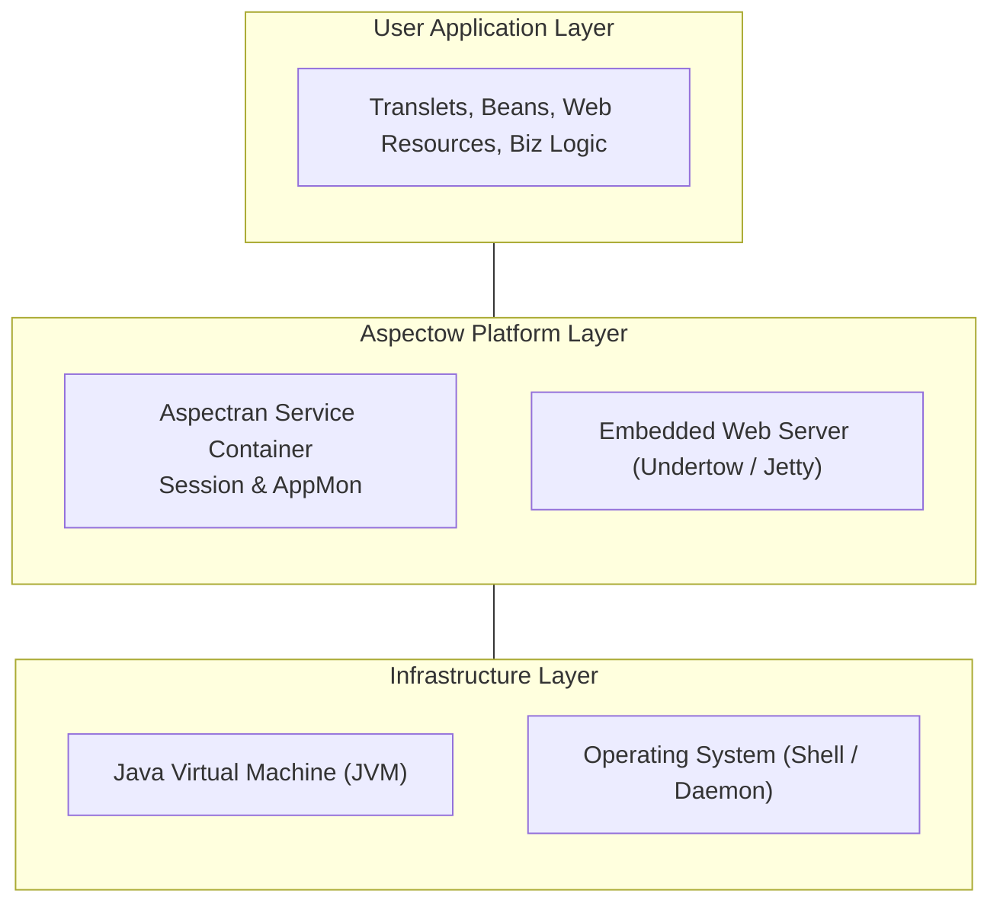
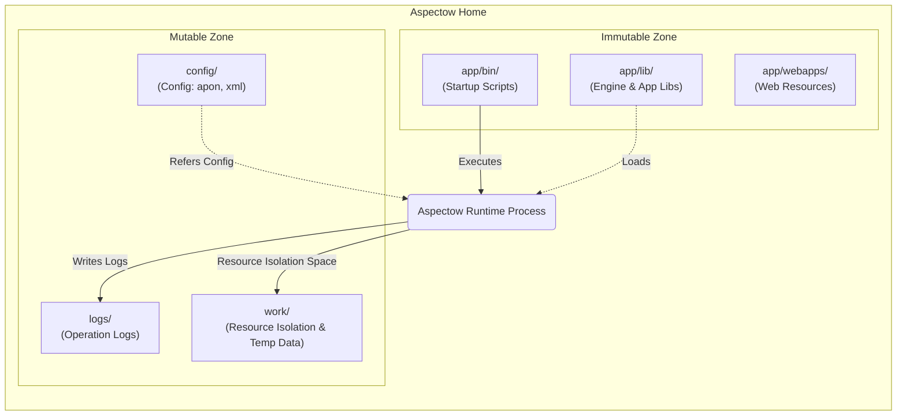
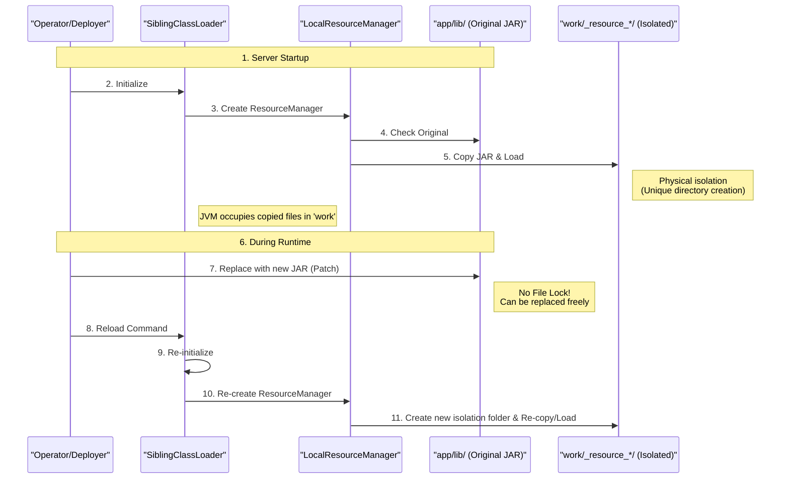

## 1. Overview: Engine and Platform

Aspectow is an enterprise WAS (Web Application Server) product built on the powerful open-source framework, **Aspectran**.

- **Aspectran (Engine)**: The core engine that provides Dependency Injection (DI), Aspect-Oriented Programming (AOP), and a request processing pipeline similar to MVC. It acts as the 'brain' of the application.
- **Aspectow (Platform)**: Provides an integrated runtime environment and operational platform to ensure the Aspectran engine performs with optimal stability and performance. It acts as the 'body' and 'environment' of the application.

Aspectow maintains the flexibility of Aspectran while adding the stability, performance, and management convenience required in enterprise environments, offering an optimal experience for both developers and operators.

### 1.1. Aspectow Runtime Stack
Illustrates the hierarchical structure of Aspectow operating on top of the OS and JVM, and how it encompasses user applications.

## 2. System Directory Architecture

Aspectow follows a standardized directory structure designed to maximize the efficiency of deployment, operation, and maintenance. Each directory has a clear architectural intent.

### 2.1. Immutable Zone
This is where system binaries and application code are located. It is updated at deployment time and should not be changed during runtime.

- **`app/bin/`**: Contains shell scripts (`start.sh`, `stop.sh`, etc.) for server startup and management.
- **`app/lib/`**: Contains the Aspectow engine and application JAR libraries.
- **`app/webapps/`**: Contains static web resources such as HTML, CSS, JavaScript, and JSP.

### 2.2. Mutable Zone
This area contains data created at runtime or configuration information that varies by environment.

- **`config/`**: Contains application configuration (`aspectran-config.apon`, `root-context.xml`) and server environment settings (`server.xml`, `logging`). Even if the code is the same, you can flexibly respond to development, testing, and production environments by simply swapping the `config`.
- **`logs/`**: Stores server operation logs and application logs.
- **`work/`**: Stores temporary data generated during server execution (session storage, JSP compilation results, etc.). Specifically, for **Safe Reloading**, JAR files from `app/lib` are copied here and loaded to prevent file locking issues. This allows files in `app/lib` to be safely replaced even while the server is running.
- **`temp/`**: Used as the system temporary directory (`java.io.tmpdir`).

### 2.3. System Directory Architecture
Shows the physical interaction between the Immutable Zone (updated at deployment) and the Mutable Zone (where data changes during operation).

## 3. Server Runtime Model

The process by which Aspectow runs as a WAS and processes requests follows this hierarchical flow:

### 3.1. Bootstrapping
1.  **Script Execution**: Scripts in the `bin` directory set JVM options and start the process.
2.  **Service Initialization**: The `AspectranService` starts and loads configurations from the `config` directory.
3.  **Web Server Startup**: The configured embedded web server (Undertow or Jetty) starts and listens on the HTTP port.
4.  **Context Loading**: `ActivityContext`, Aspectran's core container, is initialized, and all defined Beans, Translets, and Aspects are loaded into memory.

### 3.2. ClassLoader Strategy (SiblingClassLoader)
Aspectow uses a proprietary **SiblingClassLoader** mechanism. This is a core technology that not only prevents conflicts between system libraries and applications but also enables **Hot Reloading**, allowing changed classes or resources to be reflected immediately without restarting the JVM.

### 3.2.1. Safe Reloading Mechanism
Explains the principle of resource isolation via the `work` directory, illustrating why replacing files in `app/lib` does not cause errors during operation.

## 4. Core Architecture: Translet and AOP

The application logic within Aspectow is designed around the **AOP (Aspect-Oriented Programming)** philosophy.

### 4.1. Translet: The Unit of Request Processing
Instead of the complex controllers of the traditional MVC pattern, Aspectow encapsulates the entire request processing flow (Input-Logic-Output) into a single independent 'Aspect' called a **Translet**. A Translet is a **complete blueprint of processing rules** mapped to a request URL.

### 4.2. Activity: The Execution Agent
When a request comes in, Aspectow creates an execution agent called an **Activity** to process it. The Activity executes the following tasks according to the Translet specification:
- **Action Execution**: Performs actual tasks such as business logic (Bean calls) and database queries.
- **AOP Application**: Transparently applies cross-cutting concerns such as transactions, security, and logging before and after Translet execution.

This structure clearly separates business logic from infrastructure logic, maximizing maintainability.

## 5. WAS Features and Technical Characteristics

Aspectow provides various built-in features optimized for enterprise environments.

### 5.1. Integrated High-Performance Web Server
- **Undertow/Jetty**: Provides immediate service through high-performance embedded web servers (JBoss Undertow or Eclipse Jetty) without separate web server installation.
- **Light Edition**: Offers an ultra-lightweight/high-performance edition optimized for REST API processing by removing the Servlet specification.

### 5.2. Scalable Session Architecture
- **Redis Native Clustering**: The session manager, implemented based on the `Lettuce` client, utilizes Non-blocking I/O to ensure high-performance session sharing even in large-scale traffic environments.

### 5.3. AppMon (Built-in Monitoring)
- Provides accurate real-time application monitoring without overhead through metrics collected directly at the framework level, without external agents.

### 5.4. Sophisticated Server Control
- Allows for fine-grained control of core behaviors such as server listeners, thread pools, and handler chains through `server.xml`, enabling powerful customization beyond simple property configuration methods.

## 6. Deployment and Operations

Aspectow's architecture prioritizes operational convenience.

- **Flexible Resource Replacement**: By copying and loading libraries into the `work` directory, original library files can be replaced without file locking even during operation, enabling flexible deployment and minimizing downtime.
- **Operation Scripts**: Provides all necessary scripts for operation, such as service registration, startup, shutdown, and status check, through the `setup` and `bin` directories.
- **Multi-Environment Support**: Supports not only web services but also Daemon or Shell applications with the same architecture, providing a consistent development experience.
