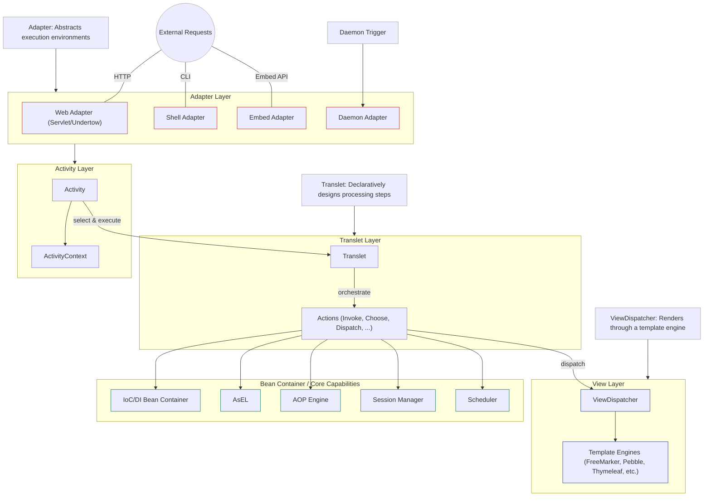
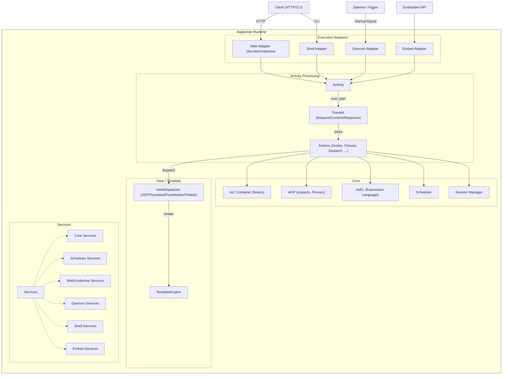
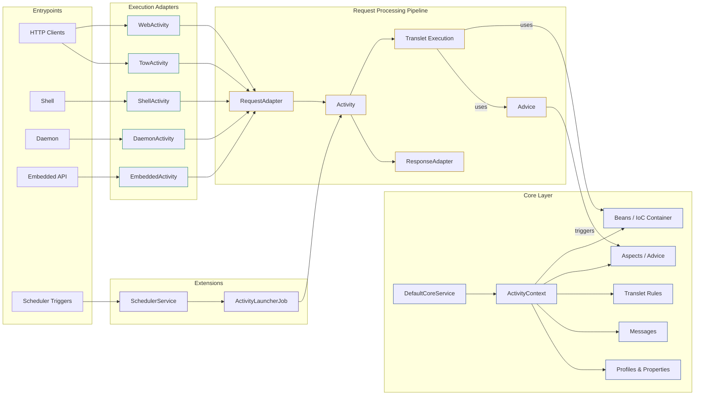
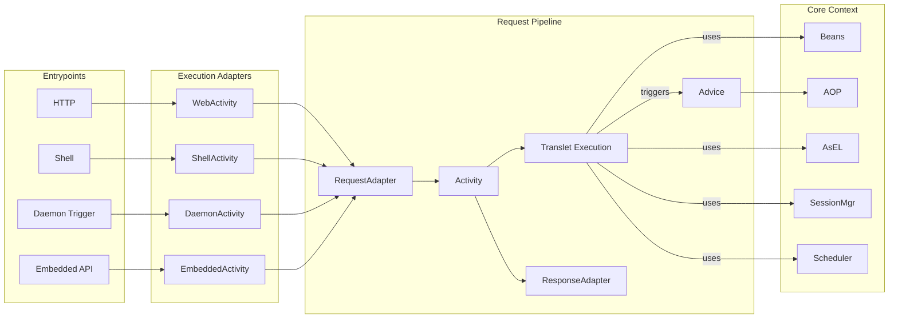
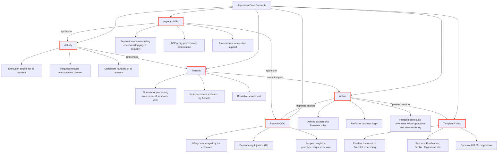
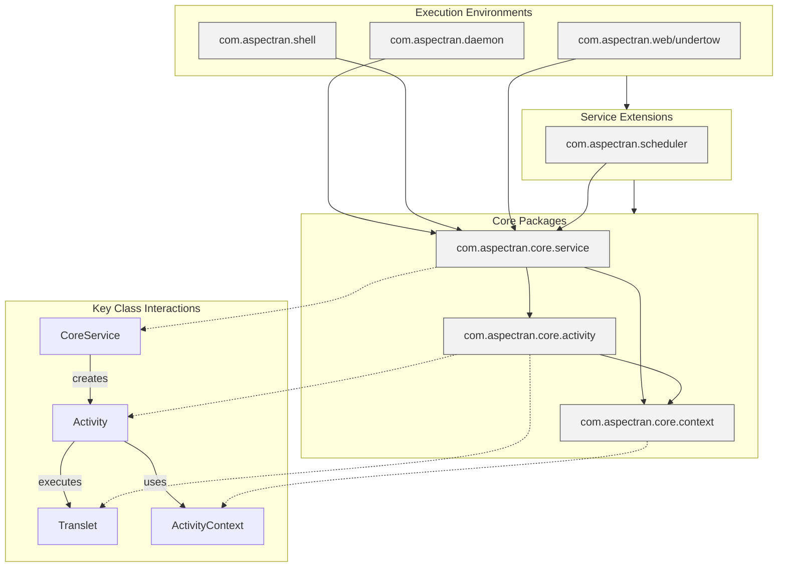
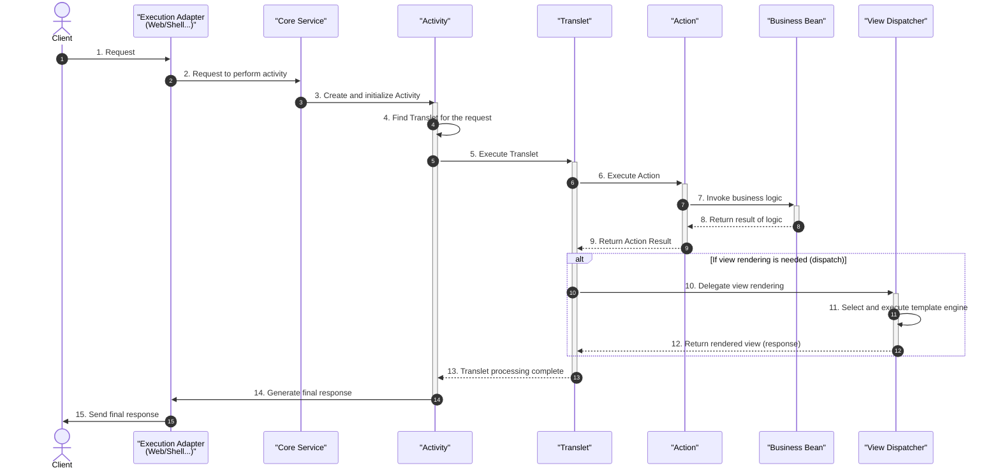
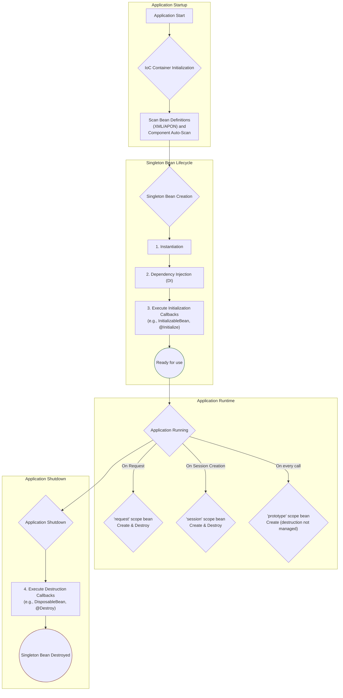
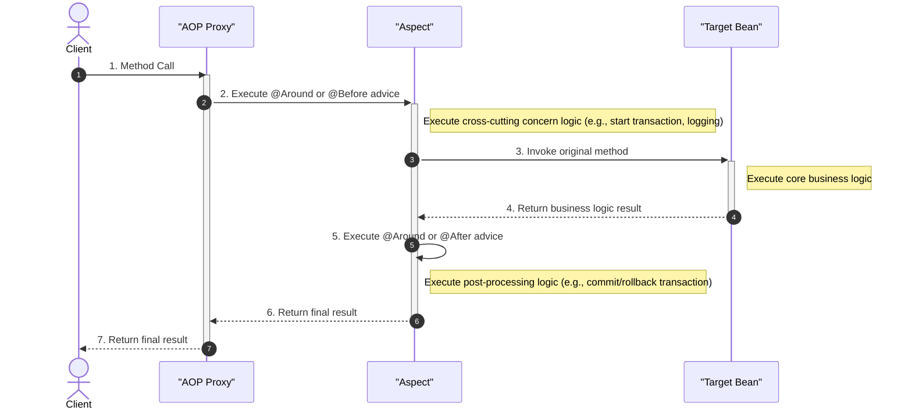

These are diagrams that represent Aspectran's architecture from various perspectives. Each diagram emphasizes a specific aspect of the system to help understand the overall structure.

- **Adapters**: Abstract the differences in execution environments (e.g., web, shell, daemon) and deliver requests to the `Activity` in a consistent manner.
- **Activity**: The execution engine that manages the lifecycle of a request. It executes the processing steps defined in a `Translet` in sequence.
- **Translet**: A set of rules for processing a request. It defines which `Action` to execute and how to send the result to a `View`.
- **Actions**: The units that perform the actual business logic. They call `Bean`s or interact with databases.
- **Core Components**: Provide core functionalities such as the `Bean` container, AOP engine, AsEL (Aspectran Expression Language), session manager, and scheduler.
- **View**: The part that displays the processing result of an `Action` to the user. It supports various template engines like `JSP`, `Thymeleaf`, etc.
- **Services**: Modules that encapsulate a specific execution environment or functionality and are organically integrated with the core.

---

### 1. Modular Layered Architecture

This diagram shows all the components of Aspectran divided by layer. It illustrates how external requests connect to core functionalities through adapters.

---

### 2. Detailed Layered Structure

A diagram that shows in more detail the main component groups within the `Aspectran Runtime` and their interactions.

---

### 3. Pipeline-Centric View

This diagram represents the process from when a request comes in until a response goes out in a pipeline format. It shows the architecture focusing on data flow and major processing steps.

---

### 4. Simplified Pipeline View

A more concise representation of the pipeline view. It is useful for quickly grasping the core processing flow.

---

### 5. Core Concept Map

A diagram that illustrates the relationships between the five most important concepts that make up Aspectran (Activity, Translet, Bean, Action, Aspect) and the View (Template).

---

### 6. Core Package Relationships

This diagram shows the dependency relationships between major packages. It helps to understand the structure of how high-level execution environments depend on the core packages.

---

### 7. Request Lifecycle Sequence

This diagram shows the interaction between major components in chronological order, from when a user request occurs until the final response is delivered.

---

### 8. Bean Lifecycle & Scopes

This shows the entire process of how the IoC container creates and manages beans. It explains the lifecycle of a `singleton` bean and when `request`, `session`, and `prototype` scope beans are created and destroyed.

---

### 9. AOP Mechanism

This shows the process where a method call is intercepted by an AOP proxy to execute advice that handles cross-cutting concerns like transactions and logging.

These diagrams will be a useful guide to understanding Aspectran's design philosophy and internal workings.
