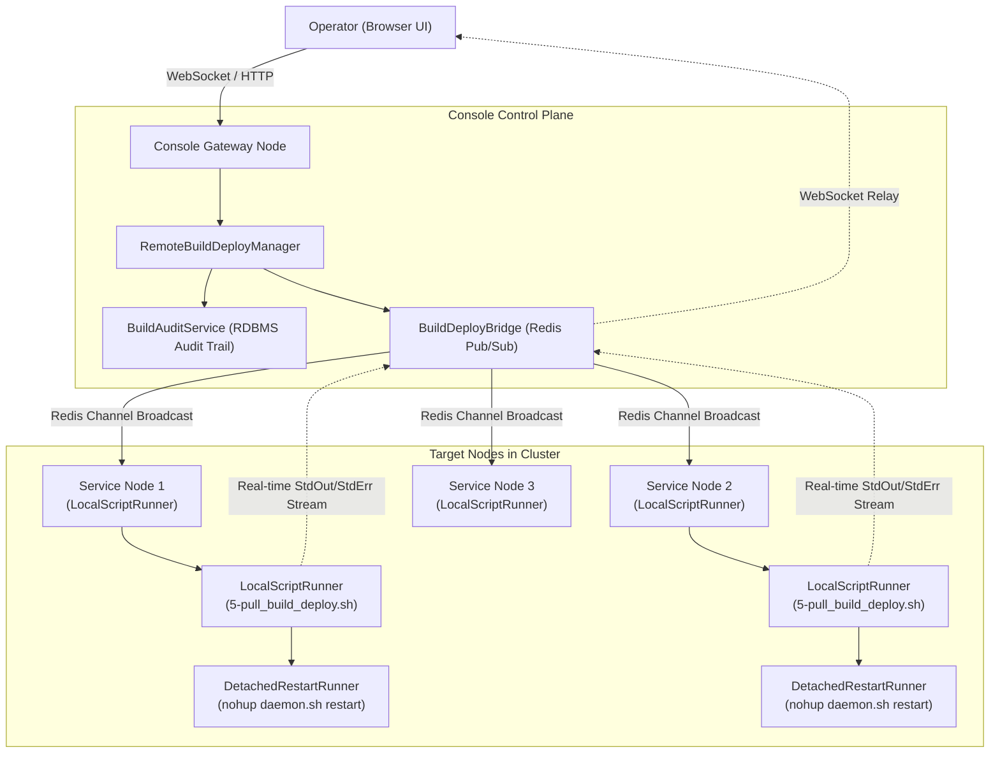

## 1. Overview & Remote Build and Deployment Architecture

The **Build & Deployment** module of Aspectow Console is a powerful centralized control plane designed to provide continuous deployment (CD) and uninterrupted lifecycle management for Aspectran-based web applications running across distributed cluster environments.

In traditional enterprise environments, deploying source updates or modifying configurations across remote servers required configuring external tools (such as Jenkins, GitLab CI) or having operators connect via SSH to manually execute shell scripts. Aspectow Console eliminates the need for complex external deployment tools: **operators can orchestrate Git source pulls, Maven compilation, asset/configuration deployments, and process-independent safe server restarts across the entire cluster or targeted node groups directly from the web console with a single click**.



### Unified Remote Deployment Architecture



### Core Components

*   **`RemoteBuildDeployManager`**: Receives build dispatch requests, generates a unique `Execution ID`, resolves target nodes according to cluster topology, and orchestrates asynchronous remote script execution.
*   **`LocalScriptRunner`**: Runs physically on each individual node, safely launching deployment shell scripts (`*.sh` or `*.bat`) and intercepting standard output (StdOut) and error (StdErr) streams to forward them to the message bridge.
*   **`DetachedRestartRunner`**: Completely detaches the OS session and process group when restarting the server daemon, ensuring that the spawned child process survives parent JVM termination to bring the node back online.
*   **`BuildDeployBridge` (`WebsocketBuildDeployBridge` & `BuildMessageBridgeHandler`)**: Leverages Redis Pub/Sub channels and virtualized WebSocket relays to stream concurrent terminal outputs from multiple nodes directly to a single browser console without network latency.
*   **`BuildAuditService`**: Permanently records all execution metadata—including operator account, target nodes, Git branch, before/after commit hashes, duration, exit codes, and full terminal log transcripts—into RDBMS storage.

---

## 2. Target Scope Selection Strategy

The **Target Node** selector at the top of the Build & Deployment console allows administrators to precisely designate the deployment scope.

| Target Type | Scope | Recommended Use Case |
| :--- | :--- | :--- |
| **All Service Nodes** (Default) | All worker service nodes in the cluster, excluding console gateway nodes | Regular application updates and configuration rollouts to business service instances |
| **All Nodes in Cluster** | All active nodes including console nodes | Full-cluster upgrades (e.g., framework version updates, global configuration propagation) |
| **Specific Group** | Nodes belonging to a designated logical group (`groupId`, e.g., `api-group`, `batch-group`) | Targeted deployments to specific functional server groups |
| **Individual Node** | A single specified cluster node | Canary releases, single-node pre-release verification, or recovering a faulty node |

---

## 3. Standard Deployment Pipelines & Script Specifications

Aspectow provides a modularized suite of 9 standardized deployment scripts covering source code synchronization, Maven packaging, configuration deployment, and web asset rollout. Select the desired script from the **Execution Action / Script** dropdown menu.

```text
┌─────────────────────────────────────────────────────────────────────────────────┐
│                           5-pull_build_deploy.sh                                │
│                                                                                 │
│   ┌──────────────┐     ┌──────────────┐     ┌──────────────┐     ┌──────────┐   │
│   │ 1. Git Pull  │ ──> │ 2. Build     │ ──> │ 3. Deploy    │ ──> │ 4. Deploy│   │
│   │ (1-pull.sh)  │     │ (2-build.sh) │     │    Config    │     │  Webapps │   │
│   └──────────────┘     └──────────────┘     └──────────────┘     └──────────┘   │
└─────────────────────────────────────────────────────────────────────────────────┘
```

### Standard Script Specifications

| Script Name | Pipeline Category | Description & Execution Workflow |
| :--- | :--- | :--- |
| **`5-pull_build_deploy.sh`** | 🚀 Standard (Recommended) | **Full Build & Deploy**: Executes Git Pull → Maven Compile & Package → `app/config` Deploy → `app/webapps` Deploy in a single automated pipeline. |
| **`6-pull_deploy.sh`** | 🚀 Standard (Fast) | **Fast Deploy**: Skips Maven recompilation; fetches latest Git source and deploys templates/static assets/configurations directly. |
| **`1-pull.sh`** | ⚙️ Single Step | **Git Pull Only**: Pulls latest commits, tags, and branch changes from the remote Git repository. |
| **`2-build.sh`** | ⚙️ Single Step | **Maven Build Only**: Runs Maven to compile source code and package application JARs into `app/lib`. |
| **`3-deploy_config.sh`** | ⚙️ Single Step | **Config Deploy Only**: Deploys configuration files from `.build` to `app/config` and restores custom overrides from `app-restore/`. |
| **`4-deploy_webapps.sh`** | ⚙️ Single Step | **Webapps Deploy Only**: Deploys web application files and static resources from `.build` to `app/webapps`. |
| **`7-pull_deploy_config_only.sh`** | 🛠️ Selective Deploy | **Pull & Deploy Config**: Pulls latest Git changes and deploys configuration files only. |
| **`8-pull_deploy_webapps_only.sh`** | 🛠️ Selective Deploy | **Pull & Deploy Webapps**: Pulls latest Git changes and deploys web application assets only. |
| **`9-pull_deploy_config_webapps_only.sh`** | 🛠️ Selective Deploy | **Pull & Deploy Config + Webapps**: Pulls latest Git changes and deploys both configurations and web assets (without build). |

> **Tip (Pipeline Flow Preview)**: Selecting any script dynamically displays a **Pipeline Flow** card below the selector, visually previewing the step-by-step pipeline stages (e.g., `1. Git Pull` → `2. Maven Build` → `3. Config Deploy` → `4. Webapps Deploy`) with color-coded badges.



---

## 4. Git Branch & Release Tag Deployment Strategy

In production environments, deploying immutable release version tags (e.g., `v1.2.0`) or rolling out emergency hotfix branches (e.g., `hotfix/auth-patch`) is a frequent operational requirement.

### Specifying Target Branch / Tag

Enter the desired Git reference in the **Git Branch / Tag (Optional)** input field before dispatching the execution.

```bash
# Example Inputs
main                 # Deploy latest commit on main branch
release/v2.1.0       # Deploy release staging branch
v2.1.0               # Deploy immutable release tag (Recommended for production)
hotfix/security-fix  # Deploy emergency patch branch
a1b2c3d4             # Pin and deploy specific commit SHA
```



### Safe Ref Validation & Working Tree Protection

Aspectow deployment scripts incorporate robust reference verification logic to prevent working tree corruption:

1.  **Metadata Synchronization**: Runs `git fetch --all --tags --prune` to synchronize all remote branches and tags.
2.  **Reference Verification**: Checks whether the input string matches a valid local tag (`refs/tags/*`), local branch (`refs/heads/*`), remote tracking branch (`origin/*`), or commit hash via `git rev-parse --verify`.
3.  **Proactive Failure Guard**: If an operator enters an invalid branch or tag name (e.g., due to a typo), the script immediately aborts (`exit 1`) with an error message (`[ERROR] Branch, tag, or commit '...' not found in repository.`) without altering the local working tree.
4.  **Instant UI Feedback**: The Console UI displays a `FAILED` badge and error summary immediately, protecting system stability from erroneous deployment attempts.

---

## 5. Interactive Real-Time Web Terminal

Aspectow Console provides an interactive dark-themed terminal that streams standard output (StdOut) and standard error (StdErr) in real time over WebSockets.



### 5.1. Real-Time ANSI Color Parsing & Rendering
The web terminal parses ANSI escape color codes in real time, rendering successful steps in green, errors in bold red, warnings in yellow, and operational information in bright blue for optimal readability.

### 5.2. Multi-Node Tabbed Interface
When deploying to multiple cluster nodes, a **Dynamic Node Tabs Bar** is automatically constructed above the terminal:

*   **All Nodes Tab**: Aggregates log streams from all participating nodes into a single consolidated timeline with node tags (`[node1]`, `[node2]`). Ideal for tracking overall cluster progression.
*   **Individual Node Tabs (`[node1]`, `[node2]`, etc.)**: Clicking any individual node tab filters the terminal to show only that node's dedicated output stream. Real-time status badges (`RUNNING`, `SUCCESS`, `FAILED`) update dynamically beside each tab title.

### 5.3. Real-Time Execution Metadata Tracking
The **Current Execution** card on the left panel dynamically computes and displays:
*   **Execution ID**: Unique execution tracking identifier (e.g., `exec-1724729100-node1`)
*   **Git Branch / Tag**: Target branch or tag applied to the run
*   **Before Commit / After Commit**: Commit hashes before and after deployment (short 8-char SHA)
*   **Started At & Duration**: Start timestamp and real-time execution duration ticker (0.1s precision)
*   **Exit Code**: Final process termination code (`0`: Success, `1+`: Error)

### 5.4. Terminal Productivity Features
*   **Auto-scroll Toggle**: Controls whether the terminal window automatically scrolls down as new log lines arrive.
*   **Clear Terminal**: Clears all current log text from the active tab.
*   **Download Logs**: Exports the complete log text of the current tab into a `build-{nodeId}-{execId}.log` text file.
*   **Abort / Cancel**: Sends an immediate abort signal to the running script process on target nodes to safely cancel in-flight deployments.

---

## 6. Process-Independent Safe Server Restart (Detached Restart)

When an application server needs to be restarted following a build or configuration rollout, standard remote shell executions fail because the child process receives a termination signal when the parent process (the existing JVM) shuts down.

Aspectow Console resolves this via **[`DetachedRestartRunner`](file:///home/aspectran/projects/public/aspectow/console/src/main/java/com/aspectran/aspectow/console/build/manager/DetachedRestartRunner.java)**:

```text
┌─────────────────────────────────────────────────────────────────────────────────┐
│                           Detached Restart Flow                                 │
│                                                                                 │
│   1. Console Web      ──> [DetachedRestartRunner]                               │
│      Trigger Restart                                                            │
│                                │                                                │
│                                ▼                                                │
│   2. Detach Process   ──> nohup sh -c 'sleep 1 && exec daemon.sh restart'       │
│      from Parent JVM       (Redirect StdIn/StdOut/StdErr to /dev/null)          │
│                                │                                                │
│                                ▼                                                │
│   3. Parent JVM       ──> Flush final WebSocket status -> Graceful Shutdown     │
│                                │                                                │
│                                ▼                                                │
│   4. Detached Child   ──> Survives JVM shutdown -> Starts new Daemon Process    │
│      Process                                                                    │
└─────────────────────────────────────────────────────────────────────────────────┘
```

### Key Engineering Principles

1.  **OS Process Session & Group Detachment**:
    - **Linux/Unix**: Spawns `nohup sh -c 'sleep 1 && exec "./daemon.sh" restart'` as an independent process group detached from the parent JVM.
    - **Windows**: Spawns a background process via `cmd.exe /c start "" /b daemon.bat restart`.
2.  **WebSocket Notification Flush Buffer (`sleep 1`)**:
    - A 1-second delay ensures that final status packets ("Restart process initiated successfully in background") are fully transmitted (flushed) over WebSockets to client browsers before JVM termination begins.
3.  **I/O Null Device Redirection**:
    - Standard input, output, and error streams of the child process are redirected to `/dev/null` (or `NUL` on Windows), preventing `SIGPIPE` crashes when the parent JVM closes its pipe descriptors.

---

## 7. Multi-Node Build Lock & Concurrency Control

When deploying to multiple instances hosted on the same machine or sharing a common filesystem, executing simultaneous full builds (`5-pull_build_deploy.sh`) could cause concurrent access collisions on the `.build` directory (such as Git `index.lock` errors or Maven target deletion failures).

Aspectow prevents this using **atomic file locking and build artifact reuse**:

1.  **Atomic Lock Acquisition (`.build.lock`, `.pull.lock`)**:
    - The first node to enter acquires an atomic file lock on the workspace and initiates Git pull and Maven build.
2.  **Safe Lock Waiting**:
    - Concurrently arriving nodes detect the lock, output `[BUILD LOCK] Another node is currently building... Waiting for completion...`, and safely wait for the leader node to finish.
3.  **Automatic Build Skip & Artifact Reuse (Build Reuse)**:
    - Once the leading node completes packaging (`BUILD SUCCESS`), waiting nodes **skip redundant Maven compilation (`Skipping redundant Maven compilation.`) and directly deploy the freshly compiled artifacts**.
    - This eliminates file lock collisions and drastically cuts total cluster deployment time.

---

## 8. Troubleshooting & Live Daemon Logs Viewer

If a build fails or a server does not recover after a restart, administrators can immediately inspect daemon logs via the **Daemon Logs** dropdown menu in the terminal header.



*   **`daemon-stderr.log`**: Retrieves the latest 200 lines of standard error logs, displaying JVM boot errors, OutOfMemoryErrors, ClassNotFoundExceptions, or startup crash traces.
*   **`daemon-stdout.log`**: Retrieves the latest 200 lines of standard output logs, including Aspectran context initialization logs.

### Troubleshooting Matrix

| Symptom / Error Message | Root Cause Analysis | Corrective Action |
| :--- | :--- | :--- |
| `[ERROR] Branch, tag, or commit '...' not found` | Specified branch/tag name does not exist in remote Git repository | Verify Git branch or tag spelling and re-execute. |
| `[ERROR] Maven build failed with exit code 1` | Source compilation error, failed unit test, or dependency resolution failure | Check error logs in the terminal, or run `mvn clean package` directly inside `.build/[APP_NAME]` on the target node. |
| `[BUILD TIMEOUT] Script execution timed out` | Execution exceeded timeout threshold (e.g., slow dependency downloads) | Check network connectivity or adjust the timeout settings in `LocalScriptRunner`. |
| Node unresponsive / `DEAD` after deployment | Port collision, database connection failure, or invalid configuration | Select **Daemon Logs → daemon-stderr.log** from the terminal header to analyze the JVM startup stack trace. |

---

## 9. Compliance Build Audit Trail

To satisfy enterprise security and compliance requirements, Aspectow Console permanently stores all execution records in the RDBMS and provides cryptographic integrity verification.

Clicking the **Audit Trail** button in the top right header opens the dedicated **Build Audit Trail** modal window (`cluster/build/audit/`).



### 9.1. Audit Record Metadata Specification

Every deployment execution generates an immutable audit record in the database (`BuildHistoryMapper`):

*   **Execution ID**: Unique execution identifier (`bld_...` format)
*   **Target Node & Requester**: Target node identifier and operator username
*   **Script Name & Parameters**: Executed script name and parameters (branch/tag, etc.)
*   **Git Commit Before / After**: Git commit hashes before and after deployment
*   **Git Branch & Commit Message**: Active Git branch and latest commit message
*   **Status & Exit Code**: Final execution state (`SUCCESS`, `FAILED`, `CANCELLED`, `TIMEOUT`) and exit code
*   **Started / Finished Time & Duration**: Execution timestamps and exact duration (0.01s precision)
*   **SHA-256 Integrity Digest**: Cryptographic hash verifying log and metadata integrity
*   **Full Terminal Output Logs**: Complete verbatim output stream captured during execution

### 9.2. Audit Interface Features

*   **Multi-Dimensional Filtering Panel**:
    *   **Target Node**: Filter records by all nodes or a specific target node.
    *   **Status**: Filter by execution state (`SUCCESS`, `FAILED`, `RUNNING`, `CANCELLED`).
    *   **Keyword Search**: Full-text search across Execution IDs, script names, commit hashes, and requester usernames.
*   **Export & Print Reports**:
    *   **Export CSV Report**: Exports all filtered audit records into a spreadsheet-compatible CSV file for compliance auditing and approval reporting.
    *   **Print Report**: Invokes the browser print dialog with navigation bars hidden and high-contrast layout optimized for print.
*   **Live Console Linking (Go to Build Console)**:
    *   Clicking an Execution ID opens the live Build Console with the exact execution context restored.

### 9.3. Audit Verification Report Modal

Clicking the **Detail** button opens a detailed verification report modal.



*   **Cryptographic Integrity Proof**:
    *   Recomputes the SHA-256 hash of the execution metadata and log stream in real time, validating it against the stored database digest.
    *   Displays a green **`Cryptographically Valid & Untampered`** badge alongside the full SHA-256 Digest string.
*   **Detailed Audit Attributes**:
    *   Presents Execution ID, target node, script name, requester, status, exit code, duration, Git branch, commit changes, commit message, and full error summary if failed.

### 9.4. Console Output Stream Modal

Clicking the **Logs** button opens the full terminal log modal.



*   **Decompressed Real-Time ANSI Color Terminal**:
    *   Decompresses and reconstructs the full console output stream from database storage in a dark-themed terminal viewer.
*   **Download Full Log**:
    *   Exports the raw terminal log text to a local file for offline debugging and long-term archiving.

---

## 10. Role-Based Access Control (RBAC) & Governance

Build and deployment operations directly affect system runtime and are strictly regulated by Aspectow Console's RBAC security subsystem:

*   **`BUILD_VIEW` Permission**: Grants read-only access to view the build console and inspect past audit records without execution privileges.
*   **`BUILD_EXECUTE` Permission**: Grants full execution authority, including running scripts (`Execute Script`), quick actions (`Quick Run`), and canceling executions (`Abort / Cancel`).
*   **`SUPER_ADMIN` Role**: Unrestricted administrative authority across all deployment and configuration capabilities.
*   **`DEMO` Role**: Build and deployment execution buttons are automatically disabled to protect sandbox environments from unauthorized modifications.
