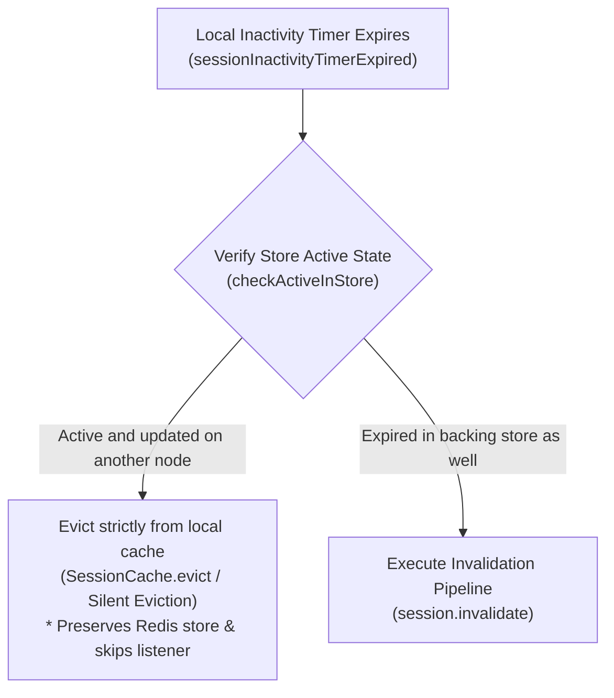
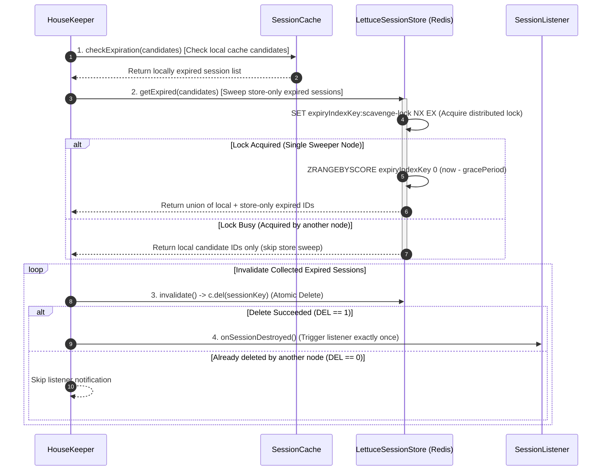

Aspectran provides its own dedicated session management architecture to support **consistent state management across all execution environments**—from standalone daemons and interactive CLI shells to microservices and enterprise web application servers—without being bound to any specific web container or servlet specification.

This guide provides an end-to-end reference covering the internal design principles and component architecture of the Aspectran Session Manager, sophisticated lifecycle control distinguishing new and normal sessions, pluggable storage backends (local files and Redis distributed clustering), concrete configuration practices for Aspectow Enterprise (Undertow) and Aspectow Edge (Netty), and application-level API usage.

## 1. Core Architecture and Design Philosophy

Rather than treating HTTP sessions as a mechanism exclusive to servlet containers, Aspectran abstracts state management so that it can be applied seamlessly across any application runtime. Going beyond merely emulating servlet container sessions, it features a cleanly decoupled component ecosystem designed for high availability, fault tolerance, and elastic scalability in cloud-native deployments.

### 1.1. Core Components

* **[`SessionManager`](https://github.com/aspectran/aspectran/blob/master/core/src/main/java/com/aspectran/core/component/session/SessionManager.java)** (Default implementation: [`DefaultSessionManager`](https://github.com/aspectran/aspectran/blob/master/core/src/main/java/com/aspectran/core/component/session/DefaultSessionManager.java))
  * The central entry point and orchestrator for all session management flows.
  * Governs the entire session lifecycle, including creation, retrieval, updates, and explicit invalidation.
  * Coordinates underlying core components such as `SessionCache`, `SessionStore`, and `HouseKeeper` to ensure optimal I/O efficiency. When a session retrieval request arrives, it inspects the primary memory cache first, loading state from persistent storage only upon a cache miss.
* **[`Session`](https://github.com/aspectran/aspectran/blob/master/core/src/main/java/com/aspectran/core/component/session/Session.java)** (Implementation: [`ManagedSession`](https://github.com/aspectran/aspectran/blob/master/core/src/main/java/com/aspectran/core/component/session/ManagedSession.java))
  * Represents an individual user's stateful session data object.
  * Encapsulates metadata (session ID, creation timestamp, last accessed timestamp, max idle intervals) and a thread-safe map of user-bound attributes.
* **[`SessionCache`](https://github.com/aspectran/aspectran/blob/master/core/src/main/java/com/aspectran/core/component/session/SessionCache.java)** (Default implementation: [`DefaultSessionCache`](https://github.com/aspectran/aspectran/blob/master/core/src/main/java/com/aspectran/core/component/session/DefaultSessionCache.java))
  * High-speed caching layer maintaining active session instances in the JVM heap.
  * Minimizes disk and network I/O toward physical storage (files, Redis, etc.), maximizing concurrent request throughput.
* **[`SessionStore`](https://github.com/aspectran/aspectran/blob/master/core/src/main/java/com/aspectran/core/component/session/SessionStore.java)** (Storage Abstraction Interface)
  * Pluggable persistence layer responsible for physical durability and cross-instance session sharing.
  * Designed with a pluggable architecture, allowing developers to switch freely between local disk storage and distributed Redis clusters purely via configuration without altering business logic.
* **`HouseKeeper`**
  * Periodic background scavenger thread that detects and purges expired sessions.
  * Permanently deletes stale, unattended sessions to prevent heap memory exhaustion and storage leakage.
* **`SessionIdGenerator`**
  * Employs cryptographically secure pseudo-random number generation (`SecureRandom`) to issue globally unique, tamper-resistant session IDs. Can append a routing identifier (`routeId`) as a suffix in clustered topologies for sticky session routing.

### 1.2. Component Interaction Lifecycle

1. **Session Creation Flow**:
   * `SessionManager.createSession()` invoked.
   * `SessionIdGenerator` issues a cryptographically secure, unique session identifier.
   * `ManagedSession` instance instantiated containing initial metadata.
   * Registered into the `SessionCache` memory tier.
   * Persisted via `SessionStore.save()` according to the active strategy (deferred in single-server mode; immediate in clustered mode).
2. **Session Retrieval Flow**:
   * `SessionManager.getSession(id)` called with the client's session identifier.
   * Checks the in-memory `SessionCache.get(id)` first.
   * Upon cache miss, loads and deserializes session state from `SessionStore.load(id)`.
   * Re-populates the loaded instance into `SessionCache` and returns it to the caller.
3. **Session Scavenging Flow**:
   * Background `SessionScheduler` periodically triggers the `HouseKeeper` thread.
   * Scans active memory registries and persistent storage indexes for expired timestamps.
   * Invokes `session.invalidate()` on expired sessions.
   * Notifies registered `SessionListener` callbacks, evicting the session permanently from both cache and persistent store.

## 2. Pluggable Storage and Clustering Strategies

Aspectran Session Manager provides a flexible storage hierarchy adaptable to distinct persistence requirements and traffic scales. Crucially, it supports **a 3-tier persistence strategy ranging from pure in-memory mode without any `sessionStore`, to local filesystem durability, to enterprise-grade Redis clustering**.

### 2.1. Pure In-Memory Sessions (Storeless / SessionStore Omitted)

* **Operating Principle**: Configured simply by omitting the `sessionStore` property entirely from the session manager bean definition and injecting only the [`SessionManagerConfig`](https://github.com/aspectran/aspectran/blob/master/core/src/main/java/com/aspectran/core/context/config/SessionManagerConfig.java) bean.
* **Characteristics**:
  * Incurs zero disk I/O and zero network communication; sessions are maintained purely within JVM heap memory (`ConcurrentHashMap`).
  * Yields the **absolute highest throughput and lowest latency** among all configurations due to zero persistence overhead.
  * Ideal for console demos (such as `aspectow-demo-console`), local testing, short-lived ephemeral session tokens, or lightweight microservices where persistence across restarts is unnecessary.
  * When the server process terminates or restarts, all active session data is reset.

```xml
<!-- Pure in-memory ultralight session manager configuration without SessionStore -->
<bean id="netty.context.root.sessionManager"
      class="com.aspectran.netty.server.session.NettySessionManager"
      scope="prototype">
    <property name="sessionManagerConfig">
        <bean class="com.aspectran.core.context.config.SessionManagerConfig">
            <argument>
                routeId: rn0
                maxActiveSessions: 100
                maxIdleSeconds: 300
            </argument>
        </bean>
    </property>
</bean>
```

### 2.2. Local File Session Store (`FileSessionStore`)

* **Operating Principle**: Persists session objects to individual binary files in a designated local directory using standard Java serialization.
* **Advantages**: Runs without database or memory cache dependencies, making it ideal for standalone daemons, local development, and single-node instances.
* **Reliability**: Seamlessly reloads valid session files upon application restarts.
* **Constraint**: Because file systems cannot be readily shared across instances, it is not suitable for multi-node load-balanced deployments.
* **File Session Store Configuration Parameters ([`FileSessionStoreFactoryBean`](https://github.com/aspectran/aspectran/blob/master/core/src/main/java/com/aspectran/core/component/session/FileSessionStoreFactoryBean.java))**:
  * `storeDir`: File directory path (e.g., `/work/_sessions/tow`, defaults to `java.io.tmpdir`)
  * `deleteUnrestorableFiles`: Whether to automatically delete corrupted or unreadable session files (default: `true`)

### 2.3. High-Performance Distributed Redis Store (`LettuceSessionStore`)

* **Operating Principle**: Persists session data to a centralized Redis standalone or cluster topology using the non-blocking **Lettuce** driver.
* **Data Structures**:
  * **Session Payload**: Stored as a binary-safe Redis `String` under `namespace:sessionId` keys.
  * **ZSET Expiry Index (`expiryIndexKey`)**: Avoids $O(N)$ full-keyspace `KEYS`/`SCAN` overhead by maintaining an atomic Sorted Set index (e.g., `aspectran:sessions:expiry`).
    * Session creation/touch atomically executes `ZADD` with the millisecond expiration timestamp as score and session ID as member.
    * Explicit invalidations invoke `ZREM` to purge index entries immediately.
    * Scavengers query `ZRANGEBYSCORE` to fetch only expired IDs in $O(\log N + M)$ cost.
* **Lightweight Codec (`SessionDataCodec`) with Magic Byte**:
  * Employs a 2-stage encoding scheme with a 1-byte header:
    * `MAGIC_FULL (0x01)`: Full binary payload containing session ID, metadata, and the attribute map.
    * `MAGIC_ID_ONLY (0x02)`: Lightweight encoding for ZSET members or lock tokens without deserializing full session attributes.
* **Redis Distributed Locking**:
  * Uses atomic `SET key value NX EX lockTtl` commands to eliminate cross-node I/O contention during scavenger sweeps.
  * **Store Scavenge Lock (`scavenge-lock`)**: Only 1 elected node per interval sweeps store-only expired sessions from the ZSET index.
  * **Orphan Cleanup Lock (`clean-lock`)**: Only 1 node performs physical bulk deletions (`doCleanOrphans`) for long-abandoned orphan sessions.
  * Distinct lock keys allow normal scavenging and orphan sweeps to execute safely and concurrently.
* **Advantages**: Multiple WAS instances maintain a completely stateless tier while sharing session state in real time. If a node fails, another node handles subsequent requests transparently without session loss.
* **Lock-Free Striped Connection Pooling**:
  * Distributes non-blocking multiplexed connections across a striped pool (`poolSize`, default: 8, range: 2–32) via `AtomicInteger` round-robin.
  * Lock-free design eliminates contention under high concurrency with Java 21+ Virtual Threads.
* **Dynamic Proxy & Resilient Auto-Reconnection**:
  * Shared connections wrapped in dynamic proxies treat `try-with-resources` `close()` calls as no-ops.
  * Transient network disconnects trigger Lettuce's automated Netty reconnect handlers without instance re-creation.
* **Supported Topologies**:
  * **Standalone**: Single-node via [`RedisConnectionPoolConfig`](https://github.com/aspectran/aspectran/blob/master/rss-lettuce/src/main/java/com/aspectran/core/component/session/redis/lettuce/RedisConnectionPoolConfig.java)
  * **Cluster**: Sharded routing via [`RedisClusterConnectionPoolConfig`](https://github.com/aspectran/aspectran/blob/master/rss-lettuce/src/main/java/com/aspectran/core/component/session/redis/lettuce/cluster/RedisClusterConnectionPoolConfig.java)
  * **Primary-Replica**: Read/write split via [`RedisPrimaryReplicaConnectionPoolConfig`](https://github.com/aspectran/aspectran/blob/master/rss-lettuce/src/main/java/com/aspectran/core/component/session/redis/lettuce/primaryreplica/RedisPrimaryReplicaConnectionPoolConfig.java)
* **Connection Pool Settings ([`AbstractConnectionPoolConfig`](https://github.com/aspectran/aspectran/blob/master/rss-lettuce/src/main/java/com/aspectran/core/component/session/redis/lettuce/AbstractConnectionPoolConfig.java))**:
  * `uri` / `redisURI`: Single connection URI (e.g., `"redis://localhost:6379/0"`)
  * `nodes` / `redisURIs`: Multi-node URIs (e.g., `"redis://node1:6379,node2:6379"`)
  * `poolSize`: Multiplexed connection count (default: `8`, range: 2–32)
  * `timeout`: Command/connect timeout (e.g., `"5s"`, `"5000ms"`, `"1m"`, default: `5s`)
  * `clientOptions`: Socket tuning (Keep-Alive, TCP NoDelay), SSL, `DisconnectedBehavior`, and automated topology refresh options
  * `clientResources`: Shared Netty `EventLoopGroup` threads and custom [`SocketAddressResolver`](https://lettuce.io/core/release/api/io/lettuce/core/resource/SocketAddressResolver.html) configurations for NAT/Docker port-forwarding environments

### 2.4. Common Store Settings (`AbstractSessionStore`)

All persistent stores ([`FileSessionStore`](https://github.com/aspectran/aspectran/blob/master/core/src/main/java/com/aspectran/core/component/session/FileSessionStore.java), [`LettuceSessionStore`](https://github.com/aspectran/aspectran/blob/master/rss-lettuce/src/main/java/com/aspectran/core/component/session/redis/lettuce/AbstractLettuceSessionStore.java)) provide uniform tuning parameters:

* **`gracePeriodSecs`**:
  * Safety buffer (in seconds, default: `60`) preventing premature eviction caused by clock skew or network lag across clustered nodes.
  * Initial pass targets sessions expired before `now - (gracePeriodSecs * 3)`, and subsequent sweeps evaluate against `now - gracePeriodSecs`.
* **`savePeriodSecs`**:
  * Minimum update interval (in seconds, default: `0`) for read-only requests (HTTP GET) that only update `lastAccessedTime` without attribute modifications.
  * **`savePeriodSecs: 0` (default)**: Flushes updated access timestamps to the store on every request completion.
  * **`savePeriodSecs > 0`**: Only flushes access timestamps if the elapsed time since the last persist exceeds `savePeriodSecs`. (Modified/dirty attributes are always persisted immediately).
* **`nonPersistentAttributes` and Marker Control**:
  * Supports excluding transient objects (sockets, DB connections) from persistence.
  * **Name-Based**: Array of attribute names to omit from serialization.
  * **Interface-Based ([`NonPersistent`](https://github.com/aspectran/aspectran/blob/master/core/src/main/java/com/aspectran/core/component/session/NonPersistent.java))**: Classes implementing `NonPersistent` are automatically skipped during serialization.
  * **Wrapper Utility ([`NonPersistentValue`](https://github.com/aspectran/aspectran/blob/master/core/src/main/java/com/aspectran/core/component/session/NonPersistentValue.java))**: Wraps third-party objects (`NonPersistentValue.wrap(value)`) without modifying their source code.

### 2.5. Standalone Mode vs. Distributed Cluster Mode

[`SessionManagerConfig`](https://github.com/aspectran/aspectran/blob/master/core/src/main/java/com/aspectran/core/context/config/SessionManagerConfig.java)'s `clusterEnabled` setting determines the source of truth:

| Dimension | Standalone Mode (`clusterEnabled: false`) | Distributed Cluster Mode (`clusterEnabled: true`) |
| :--- | :--- | :--- |
| **Source of Truth** | Primary reliance on `SessionCache` (local memory) | Absolute reliance on central `SessionStore` (Redis) |
| **Load Policy** | Uses memory cache without querying the store (max throughput) | Validates and syncs with remote store to capture updates by peer nodes |
| **Persist Policy** | Batch writes upon request completion or memory eviction | Immediate persistence on session creation, touch, and modification |
| **Design Goal** | Maximum single-node execution throughput | Flawless cross-node session consistency and zero-loss failover |

## 3. Session Lifecycle Control and Timeout Optimization

Aspectran separates new sessions from established normal sessions to counter ghost sessions generated by web crawlers and health check probes.

### 3.1. New vs. Normal Sessions

* **New Session**: Created on the first request; has not yet produced a second request.
* **Normal Session**: Validated by returning the assigned session cookie on subsequent requests.
* **Optimization**: Bots and crawlers never make a second request. Setting a very short `maxIdleSecondsForNew` purges these orphaned sessions before they consume Redis or heap capacity.

### 3.2. `SessionManagerConfig` Core Parameters

```xml
<bean class="com.aspectran.core.context.config.SessionManagerConfig">
    <argument>
        routeId: node1
        maxActiveSessions: 50000
        maxIdleSeconds: 1800
        evictionIdleSeconds: 600
        maxIdleSecondsForNew: 60
        evictionIdleSecondsForNew: 30
        scavengingIntervalSeconds: 60
        clusterEnabled: true
        saveOnCreate: true
        removeUnloadableSessions: true
    </argument>
</bean>
```

* **`routeId`**:
  * Unique routing identifier used as a suffix for session IDs (e.g., `session123.node1`) for L4/L7 sticky session load balancing.
  * If omitted, a clean session ID without suffixes is generated. In distributed deployments, it can be dynamically injected via system properties (e.g., `%{system:aspectow.node.route}`).routing and cross-node collision prevention.
* **`maxActiveSessions`**:
  * Maximum number of concurrent active session instances held in the memory cache.
  * When exceeded, the least recently used idle sessions are proactively evicted from memory to prevent OutOfMemory errors.
* **`maxIdleSeconds`**:
  * Maximum idle lifetime (in seconds) for normal sessions before permanent expiration (e.g., 1800s = 30 minutes).
  * If no request arrives within this duration, the session is permanently expired.
* **`maxIdleSecondsForNew`**:
  * Special short timeout (in seconds) applied strictly to new sessions (recommended: 30s to 60s).
  * Even if crawlers request thousands of sessions, they expire within a minute and are purged immediately.
* **`evictionIdleSeconds`**:
  * Idle duration before an active session is **evicted from the local JVM heap cache** to reclaim memory.
  * Because data remains safe in the `SessionStore`, returning users will have their session restored transparently.
* **`evictionIdleSecondsForNew`**:
  * Heap cache eviction timeout for new sessions.
* **`scavengingIntervalSeconds`**:
  * Execution interval (in seconds) of the background `HouseKeeper` cleaner thread.
  * Setting it too low incurs CPU overhead, while setting it too high leaves stale sessions in memory (recommended: 60s to 120s).
* **`clusterEnabled`**:
  * Set to `true` to enable distributed Redis clustering and multi-node consistency synchronization.
* **`saveOnCreate`**:
  * Dictates whether sessions are written to storage immediately upon creation. (Single-server optimization; in clustered mode (`clusterEnabled: true`), sessions are always saved immediately upon creation.)
* **`removeUnloadableSessions`**:
  * When `true`, automatically purges unreadable or deserialization-corrupted session records from storage (e.g., after application class refactorings) to prevent cascading errors.

### 3.3. Best Practice Profiles by Deployment Scenario

To eliminate guesswork when configuring session timeouts and cache thresholds, Aspectran provides four battle-tested configuration profiles tailored to typical enterprise deployment scenarios.

#### Configuration Matrix Across Environments

| Parameter | 1) Admin Console | 2) High-Traffic Public Web | 3) Lightweight Edge API | 4) Local Dev & Testing |
| :--- | :--- | :--- | :--- | :--- |
| **`routeId`** | `cn0` | `rn0` | `edge0` | `dev0` |
| **`maxActiveSessions`** | `999` | `50000` | `5000` | `100` |
| **`maxIdleSeconds`** | `600` (10m) | `1800` (30m) | `300` (5m) | `3600` (1h) |
| **`evictionIdleSeconds`** | `300` (5m) | `600` (10m) | `120` (2m) | `1800` (30m) |
| **`maxIdleSecondsForNew`** | `120` (2m) | `60` (1m) | `30` (30s) | `300` (5m) |
| **`evictionIdleSecondsForNew`** | `60` (1m) | `30` (30s) | `15` (15s) | `180` (3m) |
| **`scavengingIntervalSeconds`**| `180` (3m) | `60` (1m) | `60` (1m) | `300` (5m) |
| **`clusterEnabled`** | `false` | `true` | `false` | `false` |
| **Recommended Store** | Pure In-Memory or File | Redis Cluster (`Lettuce`) | Pure In-Memory | File (`FileSessionStore`)|

#### Profile 1: Administrative Console Context (`cn0` / Console Context)

Designed for the dedicated `/console` management plane accessed exclusively by authorized administrators and operators.

```xml
<bean class="com.aspectran.core.context.config.SessionManagerConfig">
    <argument>
        routeId: cn0
        maxActiveSessions: 999
        maxIdleSeconds: 600
        evictionIdleSeconds: 300
        maxIdleSecondsForNew: 120
        evictionIdleSecondsForNew: 60
        scavengingIntervalSeconds: 180
        clusterEnabled: false
    </argument>
</bean>
```

* **Rationale**:
  * **Strict Security**: Limits idle lifetime to 10 minutes (`maxIdleSeconds: 600`) to mitigate unattended workstation hijacking risks.
  * **Memory Conservation**: Evicts idle sessions from heap memory after 5 minutes (`evictionIdleSeconds: 300`).
  * **Login Accommodation**: Affords administrators a generous 2 minutes (`maxIdleSecondsForNew: 120`) to complete multi-factor authentication (MFA/OTP).
  * **Minimized Background Interference**: Extends the scavenger interval (`scavengingIntervalSeconds`) to 3 minutes (180s) to avoid unnecessary CPU cycles for small operator counts.

#### Profile 2: High-Traffic Public Web Service (High-Traffic Public Web / Enterprise)

Built for high-volume customer-facing portals subject to relentless search engine crawlers and automated bot probes.

```xml
<bean class="com.aspectran.core.context.config.SessionManagerConfig">
    <argument>
        routeId: rn0
        maxActiveSessions: 50000
        maxIdleSeconds: 1800
        evictionIdleSeconds: 600
        maxIdleSecondsForNew: 60
        evictionIdleSecondsForNew: 30
        scavengingIntervalSeconds: 60
        clusterEnabled: true
        saveOnCreate: true
    </argument>
</bean>
```

* **Rationale**:
  * **Crawler Defense**: Automatically purges bot phantom sessions after 1 minute (`maxIdleSecondsForNew: 60`) with heap eviction at 30 seconds, preventing memory and Redis saturation.
  * **High Availability**: Pairs `clusterEnabled: true` with centralized Redis stores for real-time multi-node synchronization and zero-downtime failover.
  * **Responsive Scavenging**: Maintains a tight 60-second scavenging cadence to rapidly collect expired records.

#### Profile 3: Lightweight Edge Microservices (Aspectow Edge / In-Memory)

Optimized for ultra-fast API endpoints and short-lived request contexts running inside Netty channel pipelines without servlets.

```xml
<bean class="com.aspectran.core.context.config.SessionManagerConfig">
    <argument>
        routeId: edge0
        maxActiveSessions: 5000
        maxIdleSeconds: 300
        evictionIdleSeconds: 120
        maxIdleSecondsForNew: 30
        evictionIdleSecondsForNew: 15
        scavengingIntervalSeconds: 60
        clusterEnabled: false
    </argument>
</bean>
```

* **Rationale**:
  * **Storeless Operation**: Completely omits `sessionStore` to eliminate disk and network serialization latency.
  * **Rapid Memory Reclamation**: Enforces a 5-minute lifespan (`maxIdleSeconds: 300`) with 30-second new session cleanup to preserve low memory footprints.

#### Profile 4: Local Development and Testing (Development & Testing)

Configured for developers running workstations and interactive debugging sessions.

```xml
<bean class="com.aspectran.core.context.config.SessionManagerConfig">
    <argument>
        routeId: dev0
        maxActiveSessions: 100
        maxIdleSeconds: 3600
        evictionIdleSeconds: 1800
        maxIdleSecondsForNew: 300
        evictionIdleSecondsForNew: 180
        scavengingIntervalSeconds: 300
        clusterEnabled: false
    </argument>
</bean>
```

* **Rationale**:
  * **Productivity**: Generously sets idle expiration to 1 hour (`maxIdleSeconds: 3600`) so developers are not repeatedly forced to re-login during debugging pauses.
  * **Persistence Across Restarts**: Pairs with `FileSessionStoreFactoryBean` to preserve active logins across development server restarts.

## 4. High-Reliability Clustered Scavenging & Orphan Session Cleanup Architecture

When multiple application server instances are clustered behind a load balancer (L4/L7), disparities between an individual node's local memory cache lifecycle and the central Redis persistent store lifecycle introduce complex challenges: premature invalidation of active sessions, multi-node I/O contention, duplicate event listener triggers, and storage leakage from abandoned orphan sessions. Aspectran solves these distributed challenges through a sophisticated 4-tier high-reliability scavenging architecture.

### 4.1. Local Inactivity Eviction vs. Central Store Session State (`Silent Eviction`)

* **The Problem**: In a clustered environment, a user's initial request may be served by Node A and cached locally. Subsequent requests from the same user may be routed by the load balancer to Node B, where the session remains actively used and updated in Redis. If Node A's local inactivity timer expires and Node A blindly executes `session.invalidate()`, it would delete the active session from Redis, unintentionally logging out the active user on Node B.
* **Resolution Mechanism (`checkActiveInStore`)**:
  * When a node's local inactivity timer fires (`sessionInactivityTimerExpired`), rather than immediately triggering invalidation, it calls `sessionStore.checkActiveInStore(session)` to inspect the true last-accessed timestamp and active state in the central Redis store.
  * **Active on Another Node**: If Redis reports that the session is still active and valid, the session is silently evicted strictly from Node A's JVM heap cache (`SessionCache.evict()`, Silent Eviction). The central Redis data and session destruction listeners (`sessionDestroyed`) remain completely untouched.
  * **Expired Globally**: Only if Redis confirms that the session has indeed exceeded its max idle timeout is the full invalidation pipeline (`session.invalidate()`) and destruction notification executed.



### 4.2. Dual-Tier Scavenging Pipeline (Local Candidates + Store Sweeper)

When the background scavenger (`HouseKeeper`) runs periodically, it processes in-memory session candidates and store-only expired sessions through two decoupled tiers.



1. **Tier 1: Immediate Local Candidate Verification (`sessionCache.checkExpiration(candidates)`)**:
   * Each node scans its own in-memory session cache and collects session IDs that have expired relative to the current timestamp (`now`).
   * This local evaluation operates independently without waiting for Redis distributed locks, ensuring that every node cleans its own idle memory rapidly.
2. **Tier 2: Store-Only Expired Session Sweep (`sessionStore.getExpired()`) & `scavenge-lock`**:
   * Collects expired sessions that have long been evicted from all nodes' local heap caches but still reside in Redis.
   * To prevent dozens of cluster nodes from simultaneously querying the entire Redis ZSET index and generating duplicate deserialization workloads, a distributed lock (`expiryIndexKey + ":scavenge-lock"`) is used. **Only the single node that acquires the lock performs the ZSET index sweep**.
   * Nodes that do not acquire the lock skip the Redis ZSET sweep safely, processing only their local candidate expirations.

### 4.3. Atomic Store Deletion and Exactly-Once Listener Notification

* When `session.invalidate()` is invoked on an expired session, it issues an atomic `DEL sessionKey` to Redis.
* Owing to Redis's single-command atomicity, exactly one node will receive a positive deletion result (`deletedInStore == true`).
* The `SessionManager` fires `SessionListener.sessionDestroyed()` only on the node where `deletedInStore == true`.
* This guarantees that even if multiple cluster nodes detect expiration of the same session concurrently, post-destruction logic and audit log generation execute **strictly once across the entire cluster (Exactly-Once semantics)**.

### 4.4. Physical Cleanup of Long-Abandoned Orphan Sessions (`doCleanOrphans` & `clean-lock`)

* **Cause of Orphan Sessions**: Unforeseen catastrophic node failures (OOM-killer, hardware power loss, ungraceful kills) or prolonged network partitions may leave session records stranded in the ZSET expiry index beyond the regular scavenging lifecycle.
* **Resilient Deep Cleanup (`doCleanOrphans`)**:
  * Detects deeply orphaned sessions that have lingered far past the standard expiration window (default: `now - 100 minutes`).
  * A dedicated distributed lock (`expiryIndexKey + ":clean-lock"`) ensures that a single node performs physical bulk deletion via `c.del()` and `zremrangebyscore()` without triggering listener events, preventing storage leakages.
* **Concurrency Optimization via Lock Separation**:
  * Because the store sweeper lock (`scavenge-lock`) and orphan cleanup lock (`clean-lock`) use distinct keys, regular 1–2 minute session sweeps and deep orphan purges run concurrently and smoothly without blocking each other.

## 5. Controlling Non-Persistent Attributes: `NonPersistent` & `NonPersistentValue`

When serializing sessions to Redis or disk files, non-serializable runtime handles (such as network sockets, database connections, or large rendering buffers) can trigger serialization exceptions or waste network bandwidth.

Aspectran provides a **type-safe non-persistent attribute mechanism** ensuring ephemeral objects remain strictly in local heap cache without being persisted to the backend storage.

### 5.1. Marker Interface (`NonPersistent`)

Custom domain objects intended for session storage can implement the [`NonPersistent`](https://github.com/aspectran/aspectran/blob/master/core/src/main/java/com/aspectran/core/component/session/NonPersistent.java) marker interface to be automatically excluded during `SessionData` serialization:

```java
package com.aspectran.example;

import com.aspectran.core.component.session.NonPersistent;

/**
 * Retained in heap session memory but excluded from Redis or disk storage.
 */
public class TemporarySecurityContext implements NonPersistent {

    private String temporaryToken;
    private Object activeConnection;

    public String getTemporaryToken() {
        return temporaryToken;
    }

    public void setTemporaryToken(String temporaryToken) {
        this.temporaryToken = temporaryToken;
    }

    public Object getActiveConnection() {
        return activeConnection;
    }

    public void setActiveConnection(Object activeConnection) {
        this.activeConnection = activeConnection;
    }

}
```

### 5.2. Wrapper Utility (`NonPersistentValue`)

For third-party library objects or framework-level handles (such as Netty `Channel`, Undertow internal attributes, etc.) where **the underlying class cannot be modified to implement `NonPersistent`**, use the [`NonPersistentValue`](https://github.com/aspectran/aspectran/blob/master/core/src/main/java/com/aspectran/core/component/session/NonPersistentValue.java) wrapper:

```java
import com.aspectran.core.component.session.NonPersistentValue;
import com.aspectran.core.component.session.Session;

// 1. Store a non-persistent wrapped object in the session
Object rawResource = getNativeConnection();
session.setAttribute("runtimeResource", NonPersistentValue.wrap(rawResource));

// 2. Retrieve and unwrap the attribute
Object retrieved = session.getAttribute("runtimeResource");
Connection conn = NonPersistentValue.unwrap(retrieved);
```

### 5.3. Target Candidates & Execution Mechanics

* **Target Candidates**:
  * Non-serializable runtime handles (`Socket`, `Connection`, `Thread`, `Channel`)
  * Highly sensitive single-use authentication tokens (preventing external storage leakage)
  * Large ephemeral cache payloads (reducing Redis serialization and network transfer overhead)
* **Execution Mechanics**:
  * During `SessionData.serialize()`, Aspectran evaluates each attribute value using `instanceof NonPersistent`.
  * Any object implementing `NonPersistent` (or wrapped in `NonPersistentValue`) is skipped from the serialization stream.
  * The original instance remains fully accessible in the local `SessionCache` for subsequent requests on the same node.

## 6. Environment-Specific Configuration Guide

Aspectran Session Manager's strongest advantage is its ability to easily adapt optimized bindings for the target deployment infrastructure while sharing the exact same session lifecycle engine.

### 6.1. Standalone / Shell / Daemon Deployments

CLI shell environments and daemon processes utilize sessions to track interactive user logins and task execution contexts without a web container. Configured directly in `aspectran-config.apon`:

`/app/config/aspectran-config.apon`:
```apon
shell: {
    session: {
        routeId: shell
        maxActiveSessions: 1
        maxIdleSeconds: 1800
        scavengingIntervalSeconds: 600
        fileStore: {
            storeDir: /work/_sessions/shell
        }
        enabled: true
    }
}
```

### 6.2. Aspectow Enterprise Deployments (Undertow Servlet Binding)

Aspectow Enterprise bridges Undertow's servlet specification (`io.undertow.server.session.SessionManager`) with Aspectran's core session engine via [`TowSessionManager`](https://github.com/aspectran/aspectran/blob/master/with-undertow/src/main/java/com/aspectran/undertow/server/session/TowSessionManager.java).

`/app/config/server/undertow/tow-context-root.xml`:
```xml
<!-- Servlet Context Definition -->
<bean id="tow.context.root" class="com.aspectran.undertow.server.servlet.TowServletContext">
    <property name="contextPath">/</property>
    
    <!-- Bind Servlet Session Manager -->
    <property name="sessionManager">#{tow.context.root.sessionManager}</property>
    
    <!-- Standard Servlet Cookie Configuration -->
    <property name="servletSessionConfig">
        <bean class="com.aspectran.undertow.server.servlet.TowServletSessionConfig">
            <property name="cookieName">JSESSIONID</property>
            <property name="cookiePath">/</property>
            <property name="cookieDomain">.aspectran.com</property>
            <property name="httpOnly" valueType="boolean">true</property>
            <property name="secure" valueType="boolean">false</property>
            <property name="sessionTrackingModes">
                <value>COOKIE</value>
            </property>
        </bean>
    </property>
</bean>

<!-- Undertow Session Manager and Store Profile Switching -->
<bean id="tow.context.root.sessionManager"
      class="com.aspectran.undertow.server.session.TowSessionManager"
      scope="prototype">
    <property name="sessionManagerConfig">
        <bean class="com.aspectran.core.context.config.SessionManagerConfig">
            <argument>
                routeId: %{system:aspectow.node.route}
                maxActiveSessions: 10000
                maxIdleSeconds: 1800
                evictionIdleSeconds: 900
                maxIdleSecondsForNew: 60
                evictionIdleSecondsForNew: 30
                scavengingIntervalSeconds: 90
                clusterEnabled: false
            </argument>
        </bean>
    </property>

    <!-- Local Development: File-based Session Store -->
    <properties profile="!prod">
        <item name="sessionStore">
            <bean class="com.aspectran.core.component.session.FileSessionStoreFactoryBean">
                <property name="storeDir">%{system:aspectran.workPath:/work}/_sessions/%{tow.context.root.name}</property>
                <property name="gracePeriodSecs" valueType="int">30</property>
            </bean>
        </item>
    </properties>

    <!-- Production: High-Availability Redis Distributed Clustering -->
    <properties profile="prod">
        <item name="sessionStore">
            <bean class="com.aspectran.core.component.session.redis.lettuce.DefaultLettuceSessionStoreFactoryBean">
                <property name="poolConfig">
                    <bean class="com.aspectran.core.component.session.redis.lettuce.RedisConnectionPoolConfig">
                        <property name="uri">%{system:redis.uri}/10</property>
                    </bean>
                </property>
            </bean>
        </item>
    </properties>
</bean>
```

### 6.3. Aspectow Edge Deployments (Netty Non-Servlet Binding)

Aspectow Edge eliminates servlet container overhead by running [`NettySessionManager`](https://github.com/aspectran/aspectran/blob/master/with-netty/src/main/java/com/aspectran/netty/server/session/NettySessionManager.java) and [`NettySessionConfig`](https://github.com/aspectran/aspectran/blob/master/with-netty/src/main/java/com/aspectran/netty/server/session/NettySessionConfig.java) directly within Netty's HTTP channel pipeline.

`/app/config/server/netty/netty-context-root.xml`:
```xml
<!-- Netty Context Definition -->
<bean id="netty.context.root" class="com.aspectran.netty.server.NettyContext">
    <property name="contextPath">/</property>
    
    <!-- Bind Lightweight Netty Session Manager -->
    <property name="sessionManager">#{netty.context.root.sessionManager}</property>
</bean>

<!-- Netty Session Manager Configuration -->
<bean id="netty.context.root.sessionManager"
      class="com.aspectran.netty.server.session.NettySessionManager"
      scope="prototype">
    <!-- Netty HTTP Session Cookie Policy -->
    <property name="sessionConfig">
        <bean class="com.aspectran.netty.server.session.NettySessionConfig">
            <property name="cookieName">JSESSIONID</property>
            <property name="cookiePath">/</property>
            <property name="cookieDomain">.aspectran.com</property>
            <property name="httpOnly" valueType="boolean">true</property>
            <property name="secure" valueType="boolean">false</property>
            <property name="sameSite">Lax</property>
            <property name="maxAge" valueType="int">-1</property>
        </bean>
    </property>

    <!-- Session Lifecycle & Clustering Policy -->
    <property name="sessionManagerConfig">
        <bean class="com.aspectran.core.context.config.SessionManagerConfig">
            <argument>
                routeId: %{system:aspectow.node.route}
                maxActiveSessions: 50000
                maxIdleSeconds: 1800
                evictionIdleSeconds: 600
                maxIdleSecondsForNew: 60
                evictionIdleSecondsForNew: 30
                scavengingIntervalSeconds: 60
                clusterEnabled: false
            </argument>
        </bean>
    </property>

    <!-- Local Development: File Session Store -->
    <properties profile="!prod">
        <item name="sessionStore">
            <bean class="com.aspectran.core.component.session.FileSessionStoreFactoryBean">
                <property name="storeDir">%{system:aspectran.workPath:/work}/_sessions/%{netty.context.root.name}</property>
                <property name="gracePeriodSecs" valueType="int">30</property>
            </bean>
        </item>
    </properties>

    <!-- Production: High-Availability Redis Distributed Clustering -->
    <properties profile="prod">
        <item name="sessionStore">
            <bean class="com.aspectran.core.component.session.redis.lettuce.DefaultLettuceSessionStoreFactoryBean">
                <property name="poolConfig">
                    <bean class="com.aspectran.core.component.session.redis.lettuce.RedisConnectionPoolConfig">
                        <property name="uri">%{system:redis.uri}/10</property>
                    </bean>
                </property>
            </bean>
        </item>
    </properties>
</bean>
```

#### `NettySessionConfig` Cookie Parameters

* **`cookieName`**: Cookie name for session tracking (default: `JSESSIONID`).
* **`cookiePath`**: Valid URL path for the session cookie (default: `/`).
* **`cookieDomain`**: Optional domain scope for cross-subdomain cookie sharing (e.g., `.aspectran.com`).
* **`httpOnly`**: Blocks JavaScript `document.cookie` access to prevent XSS theft (default: `true`).
* **`secure`**: Restricts cookie transmission to HTTPS encrypted channels (recommended in production: `true`).
* **`sameSite`**: CSRF defense setting (`Strict`, `Lax`, `None`, default: `Lax`).
* **`maxAge`**: Cookie lifespan in seconds (default `-1` denotes an in-memory session cookie purged on browser close).

## 7. Session Lifecycle Event Listeners

To implement audit logging or track active visitor metrics upon session creation, destruction, or attribute mutation, register custom listeners implementing `SessionListener`.

### 7.1. Custom Listener Implementation

```java
package com.aspectran.example.listener;

import com.aspectran.core.component.session.Session;
import com.aspectran.core.component.session.SessionListener;
import org.slf4j.Logger;
import org.slf4j.LoggerFactory;

public class UserSessionTrackingListener implements SessionListener {

    private static final Logger logger = LoggerFactory.getLogger(UserSessionTrackingListener.class);

    @Override
    public void sessionCreated(Session session) {
        logger.info("New session created: id={}", session.getId());
    }

    @Override
    public void sessionDestroyed(Session session) {
        logger.info("Session destroyed: id={}, lastAccessed={}", session.getId(), session.getLastAccessedTime());
    }

}
```

### 7.2. Methods for Registering Session Listeners

Aspectran provides **two standard approaches** to register session listeners based on application architecture and operational requirements.

#### Approach 1: Declarative Registration via `DefaultSessionListenerRegistration` Bean

A declarative approach using [`DefaultSessionListenerRegistration`](https://github.com/aspectran/aspectran/blob/master/core/src/main/java/com/aspectran/core/component/session/DefaultSessionListenerRegistration.java), the standard implementation of [`SessionListenerRegistration`](https://github.com/aspectran/aspectran/blob/master/core/src/main/java/com/aspectran/core/component/session/SessionListenerRegistration.java).

* **Operating Principle**:
  * Can be initialized with a specific server bean ID (e.g., `tow.server`, `netty.server`) and a default target context name or path (`root`, `/`, etc.).
  * If the server bean ID is omitted, it **auto-detects** the single [`SessionManagerProvider`](https://github.com/aspectran/aspectran/blob/master/core/src/main/java/com/aspectran/core/component/session/SessionManagerProvider.java) bean (such as `TowServer` in Undertow or `NettyServer` in Netty) registered in the BeanRegistry.
  * When `nameOrPath` is `null`, `""`, `"/"`, or `"root"`, it automatically resolves and routes to the root or single deployment context's `SessionManager`.

* **XML Bean Definition (`support.xml`)**:

```xml
<!-- 1. Explicitly specifying the server bean ID and default context (root) -->
<bean id="sessionListenerRegistration"
      class="com.aspectran.core.component.session.DefaultSessionListenerRegistration"
      lazyInit="true">
    <argument>netty.server</argument>
    <argument>root</argument>
</bean>

<!-- 2. Auto-detecting the SessionManagerProvider without specifying a server ID -->
<bean id="sessionListenerRegistration"
      class="com.aspectran.core.component.session.DefaultSessionListenerRegistration"
      lazyInit="true"/>
```

* **Registering and Deregistering Listeners in Java Code**:

```java
package com.aspectran.example.support;

import com.aspectran.core.component.bean.annotation.Autowired;
import com.aspectran.core.component.bean.annotation.Component;
import com.aspectran.core.component.bean.ablility.InitializableBean;
import com.aspectran.core.component.bean.ablility.DisposableBean;
import com.aspectran.core.component.session.DefaultSessionListenerRegistration;
import com.aspectran.core.component.session.SessionListener;
import com.aspectran.example.listener.UserSessionTrackingListener;

@Component
public class SessionListenerManager implements InitializableBean, DisposableBean {

    private final DefaultSessionListenerRegistration registration;

    private final SessionListener trackingListener = new UserSessionTrackingListener();

    @Autowired
    public SessionListenerManager(DefaultSessionListenerRegistration registration) {
        this.registration = registration;
    }

    @Override
    public void initialize() {
        // Registers listener to the default configured context (root)
        registration.register(trackingListener);

        // Can also register to a specific context (e.g., "admin") by name or path
        // registration.register(trackingListener, "admin");
    }

    @Override
    public void destroy() {
        // Deregisters the listener
        registration.remove(trackingListener);
    }

}
```

#### Approach 2: Direct Registration via `SessionManagerProvider` or `SessionManager`

A programmatic approach where you inject the server bean itself (`SessionManagerProvider`) or individual context `SessionManager` instances and attach listeners directly.

* **Operating Principle**:
  * Both `TowServer` (Undertow) and `NettyServer` (Netty) implement the [`SessionManagerProvider`](https://github.com/aspectran/aspectran/blob/master/core/src/main/java/com/aspectran/core/component/session/SessionManagerProvider.java) interface.
  * Retrieve the target [`SessionManager`](https://github.com/aspectran/aspectran/blob/master/core/src/main/java/com/aspectran/core/component/session/SessionManager.java) via `server.getSessionManager()` or `server.getSessionManager(contextNameOrPath)`, and invoke `addSessionListener(listener)` directly.
  * When you already have access to the session manager instance, this approach is the most straightforward and avoids extra registration bean lookups.

* **Direct Registration in Java Component**:

```java
package com.aspectran.example.support;

import com.aspectran.core.component.bean.annotation.Autowired;
import com.aspectran.core.component.bean.annotation.Component;
import com.aspectran.core.component.bean.ablility.InitializableBean;
import com.aspectran.core.component.bean.ablility.DisposableBean;
import com.aspectran.core.component.session.SessionListener;
import com.aspectran.core.component.session.SessionManager;
import com.aspectran.core.component.session.SessionManagerProvider;
import com.aspectran.example.listener.UserSessionTrackingListener;

@Component
public class DirectSessionListenerRegistrar implements InitializableBean, DisposableBean {

    private final SessionManagerProvider sessionManagerProvider;

    private final SessionListener trackingListener = new UserSessionTrackingListener();

    @Autowired
    public DirectSessionListenerRegistrar(SessionManagerProvider sessionManagerProvider) {
        this.sessionManagerProvider = sessionManagerProvider;
    }

    @Override
    public void initialize() {
        // Retrieve SessionManager for the root context and attach listener directly
        SessionManager sessionManager = sessionManagerProvider.getSessionManager();
        if (sessionManager != null) {
            sessionManager.addSessionListener(trackingListener);
        }

        // When registering to a specific context (e.g., "console"):
        // SessionManager consoleSessionManager = sessionManagerProvider.getSessionManager("console");
        // if (consoleSessionManager != null) {
        //     consoleSessionManager.addSessionListener(trackingListener);
        // }
    }

    @Override
    public void destroy() {
        SessionManager sessionManager = sessionManagerProvider.getSessionManager();
        if (sessionManager != null) {
            sessionManager.removeSessionListener(trackingListener);
        }
    }

}
```

## 8. Multi-Context Session Isolation Architecture

Aspectow server architectures enforce strict **Multi-Context Session Isolation**:

* **Isolation Principle**: Within a single JVM, the public business service context (`/`) and the administrative management console context (`/console`) maintain dedicated, completely independent `SessionManager` instances.
* **Security**: Administrator session tokens and authentication credentials created under `/console` are isolated at the heap cache and storage keyspace levels from public contexts. Security vulnerabilities in public web modules cannot leak administrative session state.
* **Domain Sharing Pattern**: When single sign-on (SSO) across subdomains is explicitly desired, configuring a shared `cookieDomain` and harmonizing Redis keyspace prefixes allows secure federation across contexts.

## 9. Application Code: Unified Session API

Application components (Translet actions, controllers, business services) interact with sessions using Aspectran's unified [`SessionAdapter`](https://github.com/aspectran/aspectran/blob/master/core/src/main/java/com/aspectran/core/adapter/SessionAdapter.java) rather than tying business logic to `HttpServletRequest`, `HttpSession`, or Netty native channel buffers:

```java
package com.aspectran.example.action;

import com.aspectran.core.activity.Translet;
import com.aspectran.core.adapter.SessionAdapter;
import com.aspectran.core.component.bean.annotation.Action;
import com.aspectran.core.component.bean.annotation.Component;

@Component
public class LoginAction {

    @Action("login")
    public String login(Translet translet) {
        String username = translet.getParameter("username");
        String password = translet.getParameter("password");

        if (authenticate(username, password)) {
            // Retrieve container-agnostic SessionAdapter
            SessionAdapter sessionAdapter = translet.getSessionAdapter();
            
            // Set session attributes (auto-synced to cache and persistent store)
            sessionAdapter.setAttribute("currentUser", username);
            sessionAdapter.setAttribute("loginTime", System.currentTimeMillis());
            
            return "SUCCESS";
        }
        return "FAIL";
    }

    @Action("logout")
    public void logout(Translet translet) {
        SessionAdapter sessionAdapter = translet.getSessionAdapter();
        if (sessionAdapter != null) {
            // Invalidate session immediately across cluster and storage
            sessionAdapter.invalidate();
        }
    }

    private boolean authenticate(String u, String p) {
        return "admin".equals(u) && "secret".equals(p);
    }

}
```

* **Zero-Modification Portability**: The Java action code above executes identically across Undertow servlet environments, Netty asynchronous pipelines, or standalone automated command-line testing without modifying a single line of source code.
* **Thread Safety**: Attribute mutations within `SessionAdapter` are thread-safe and protected by `DefaultSessionManager` concurrency controls in multithreaded environments.

## 10. Conclusion

Aspectran Session Manager is a comprehensive **enterprise-grade state management framework** that goes far beyond a simple key-value store:

* **Infrastructure Agnostic**: Unifies state management semantics across Servlets, Netty, CLI shells, and daemons into a single developer and operations paradigm.
* **Intelligent Resource Defense**: Safeguards system memory and Redis storage against crawlers via dual new/normal session timeout algorithms.
* **Elastic Scalability**: Smoothly shifts from file-based local development to high-throughput Redis clustering purely via configuration without code modifications.
* **High-Reliability Clustered Scavenging**: Maintains seamless cluster consistency with Sorted Set expiry indexes, ultra-lightweight magic byte codecs, distributed lock concurrency control, Silent Eviction, and Exactly-Once session destruction notifications.
* **Enterprise Security**: Delivers multi-context isolation, `NonPersistent` and `NonPersistentValue` persistence boundary controls, and modern cookie security flags (`HttpOnly`, `SameSite`, `Secure`) to meet rigorous enterprise security requirements.
