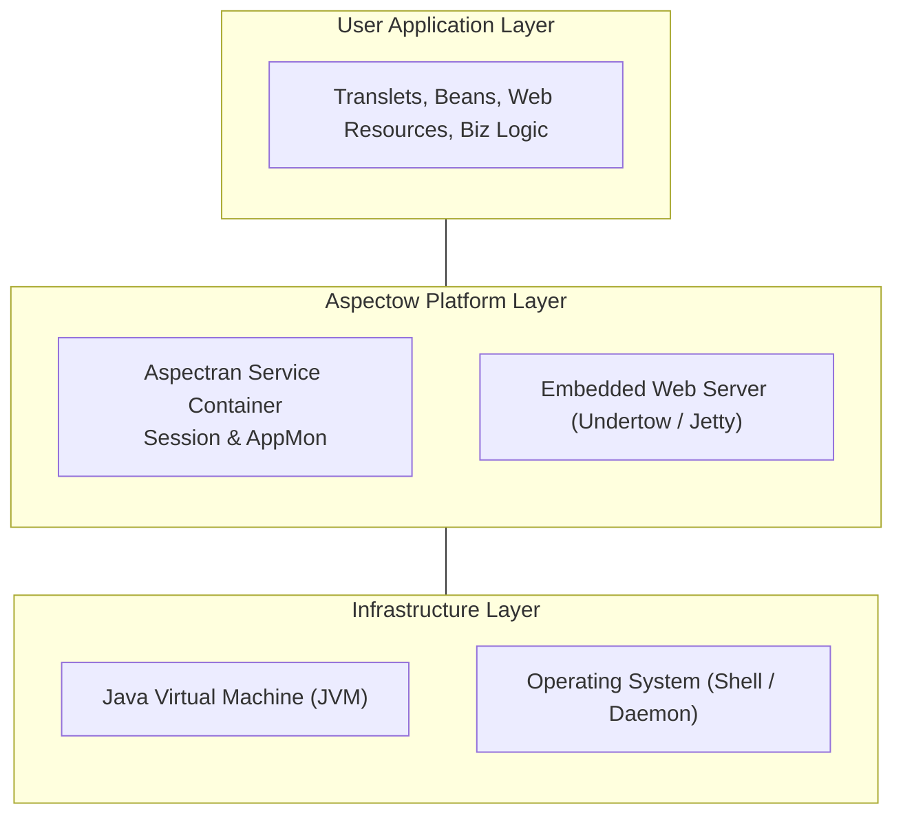
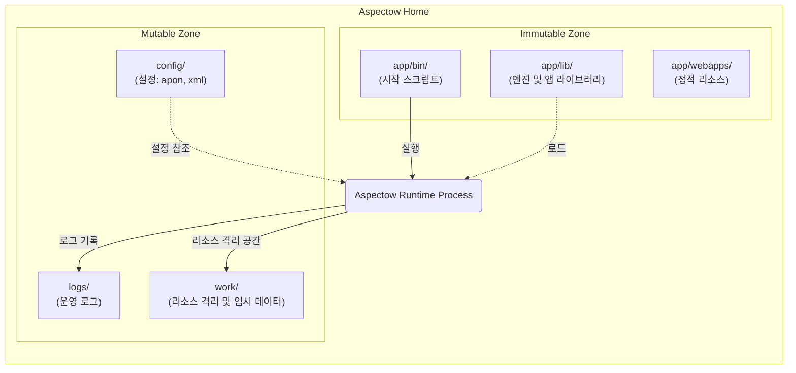
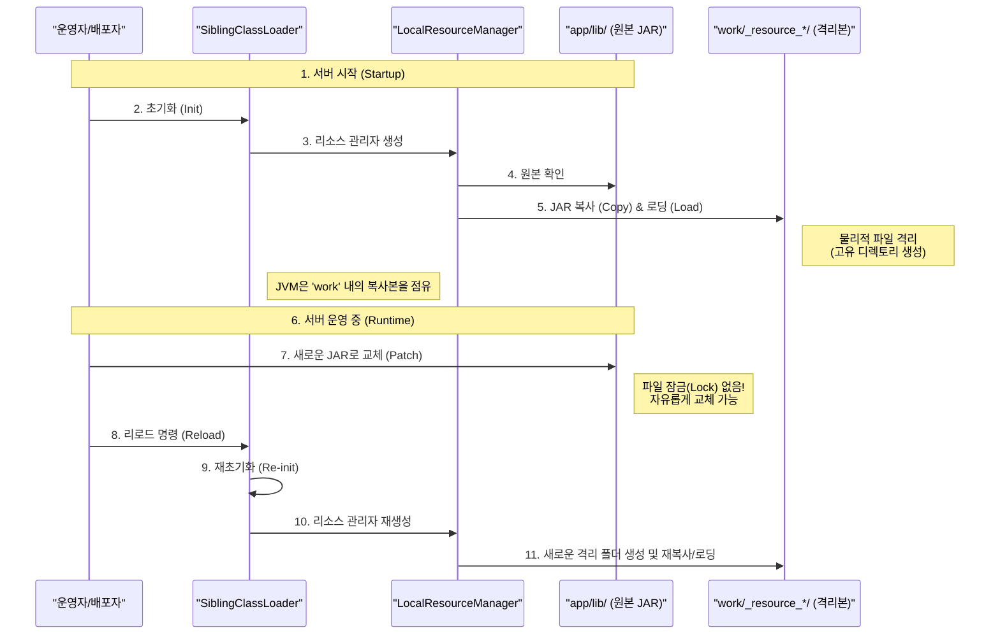

## 1. 개요: 엔진과 플랫폼

Aspectow는 강력한 오픈소스 프레임워크인 **Aspectran**을 기반으로 구축된 엔터프라이즈 WAS(Web Application Server) 제품입니다.

- **Aspectran (Engine)**: DI(Dependency Injection), AOP(Aspect-Oriented Programming), 그리고 MVC와 유사한 요청 처리 파이프라인을 제공하는 핵심 엔진입니다. 애플리케이션의 '두뇌' 역할을 합니다.
- **Aspectow (Platform)**: Aspectran 엔진이 최적의 성능과 안정성을 발휘할 수 있도록 통합된 런타임 환경과 운영 플랫폼을 제공합니다. 애플리케이션의 '몸체'이자 '환경' 역할을 합니다.

Aspectow는 Aspectran의 유연함을 유지하면서도, 엔터프라이즈 환경에서 요구되는 안정성, 성능, 관리 편의성을 더하여 개발자와 운영자 모두에게 최적의 경험을 제공합니다.

### 1.1. Aspectow 런타임 스택 (Runtime Stack)
Aspectow가 OS 및 JVM 위에서 어떤 계층 구조로 작동하며, 사용자 애플리케이션을 어떻게 포용하는지 보여줍니다.

## 2. 시스템 디렉토리 아키텍처

Aspectow는 배포, 운영, 유지보수의 효율성을 극대화하기 위해 설계된 표준화된 디렉토리 구조를 따릅니다. 각 디렉토리는 명확한 아키텍처적 의도를 가지고 있습니다.

### 2.1. 불변 영역 (Immutable Zone)
시스템 바이너리와 애플리케이션 코드가 위치하는 영역으로, 배포 시점에 갱신되며 런타임 중에는 변경되지 않아야 합니다.

- **`app/bin/`**: 서버 구동 및 관리를 위한 쉘 스크립트(`start.sh`, `stop.sh` 등)가 위치합니다.
- **`app/lib/`**: Aspectow 엔진 및 애플리케이션의 JAR 라이브러리가 위치합니다.
- **`app/webapps/`**: HTML, CSS, JavaScript, JSP 등 정적 웹 리소스가 위치합니다.

### 2.2. 가변 영역 (Mutable Zone)
런타임에 생성되는 데이터나, 환경에 따라 달라지는 설정 정보가 위치합니다.

- **`config/`**: 애플리케이션 설정(`aspectran-config.apon`, `root-context.xml`)과 서버 환경 설정(`server.xml`, `logging`)이 위치합니다. 코드는 동일하더라도 `config`만 교체하여 개발, 테스트, 운영 환경에 유연하게 대응할 수 있습니다.
- **`logs/`**: 서버 운영 로그 및 애플리케이션 로그가 적재됩니다.
- **`work/`**: 서버 실행 중 생성되는 임시 데이터(세션 저장소, JSP 컴파일 결과 등)가 저장됩니다. 특히 **안전한 리로딩(Safe Reloading)**을 위해 `app/lib`의 JAR 파일들을 이곳으로 복사하여 로드함으로써, 파일 잠금(File Locking) 문제를 방지합니다. 덕분에 서버가 가동 중인 상태에서도 `app/lib` 내의 파일을 안전하게 교체할 수 있습니다.
- **`temp/`**: 시스템 임시 디렉토리(`java.io.tmpdir`)로 사용됩니다.

### 2.3. 시스템 디렉토리 구조도 (System Directory Architecture)
배포 시 변경되는 불변 영역과 운영 중 데이터가 변하는 가변 영역이 물리적으로 어떻게 상호작용하는지 보여줍니다.

## 3. 서버 런타임 모델

Aspectow가 WAS로서 구동되고 요청을 처리하는 과정은 다음과 같은 계층적 흐름을 따릅니다.

### 3.1. 부트스트래핑 (Bootstrapping)
1.  **스크립트 실행**: `bin` 디렉토리의 스크립트를 통해 JVM 옵션을 설정하고 프로세스를 시작합니다.
2.  **서비스 초기화**: `AspectranService`가 구동되며 `config` 디렉토리의 설정을 로드합니다.
3.  **웹 서버 시작**: 설정된 내장 웹 서버(Undertow 또는 Jetty)가 시작되고, HTTP 포트를 리스닝합니다.
4.  **컨텍스트 로드**: Aspectran의 핵심 컨테이너인 `ActivityContext`가 초기화되며, 정의된 모든 Bean, Translet, Aspect가 메모리에 로드됩니다.

### 3.2. 클래스로더 전략 (SiblingClassLoader)
Aspectow는 독자적인 **SiblingClassLoader** 메커니즘을 사용합니다. 이는 시스템 라이브러리와 애플리케이션 간의 충돌을 방지할 뿐만 아니라, JVM 재시작 없이 변경된 클래스나 리소스를 즉시 반영하는 **핫 리로딩(Hot Reloading)**을 가능하게 하는 핵심 기술입니다.

### 3.2.1. 안전한 리로딩 메커니즘 (Safe Reloading Mechanism)
왜 운영 중에 `app/lib`의 파일을 교체해도 에러가 발생하지 않는지, `work` 디렉토리를 통한 리소스 격리 원리를 설명합니다.

## 4. 핵심 아키텍처: Translet과 AOP

Aspectow 내부의 애플리케이션 로직은 **AOP(관점 지향 프로그래밍)** 철학을 중심으로 설계되었습니다.

### 4.1. Translet: 요청 처리의 단위
전통적인 MVC 패턴의 복잡한 컨트롤러 대신, Aspectow는 요청 처리의 모든 과정(입력-로직-출력)을 하나의 독립된 '관점'인 **Translet**으로 캡슐화합니다. Translet은 요청 URL에 매핑된 **처리 규칙의 완전한 설계도**입니다.

### 4.2. Activity: 실행 에이전트
요청이 들어오면 Aspectow는 이를 처리할 **Activity**라는 실행 에이전트를 생성합니다. Activity는 Translet 명세서에 따라 다음 작업들을 수행합니다.
- **Action 실행**: 비즈니스 로직(Bean 호출), DB 조회 등의 실질적인 작업을 수행합니다.
- **AOP 적용**: 트랜잭션, 보안, 로깅 등의 공통 관심사를 Translet 실행 전후에 투명하게 적용합니다.

이 구조는 비즈니스 로직과 인프라 로직을 완벽하게 분리하여 유지보수성을 극대화합니다.

## 5. WAS 기능 및 기술적 특징

Aspectow는 엔터프라이즈 환경에 최적화된 다양한 내장 기능을 제공합니다.

### 5.1. 고성능 웹 서버 통합
- **Undertow/Jetty**: 별도의 웹 서버 설치 없이 고성능 내장 웹 서버(JBoss Undertow 또는 Eclipse Jetty)를 통해 즉시 서비스를 제공할 수 있습니다.
- **Light Edition**: 서블릿 스펙을 제거하여 REST API 처리에 최적화된 초경량/고성능 에디션을 제공합니다.

### 5.2. 확장 가능한 세션 아키텍처
- **Redis 네이티브 클러스터링**: `Lettuce` 클라이언트를 기반으로 구현된 세션 매니저는 Non-blocking I/O를 활용하여 대규모 트래픽 환경에서도 고성능 세션 공유를 보장합니다.

### 5.3. AppMon (내장 모니터링)
- 외부 에이전트 없이 프레임워크 레벨에서 직접 수집하는 메트릭을 통해, 오버헤드 없이 정확한 실시간 애플리케이션 모니터링을 제공합니다.

### 5.4. 정교한 서버 제어
- `server.xml`을 통해 서버의 리스너, 스레드 풀, 핸들러 체인 등 핵심 동작을 세밀하게 제어할 수 있어, 단순한 프로퍼티 설정 방식을 넘어서는 강력한 커스터마이징이 가능합니다.

## 6. 배포 및 운영

Aspectow의 아키텍처는 운영 편의성을 최우선으로 고려합니다.

- **유연한 리소스 교체**: `work` 디렉토리로의 라이브러리 복사 로딩 방식을 통해, 운영 중에도 파일 잠금 없이 원본 라이브러리를 교체할 수 있어 유연한 배포와 운영 중단 시간 최소화가 가능합니다.
- **운영 스크립트**: `setup` 및 `bin` 디렉토리를 통해 서비스 등록, 시작, 종료, 상태 확인 등 운영에 필요한 모든 스크립트를 기본 제공합니다.
- **다양한 환경 지원**: 웹 서비스뿐만 아니라, 동일한 아키텍처로 데몬(Daemon)이나 쉘(Shell) 애플리케이션도 구동할 수 있어 일관된 개발 경험을 제공합니다.
