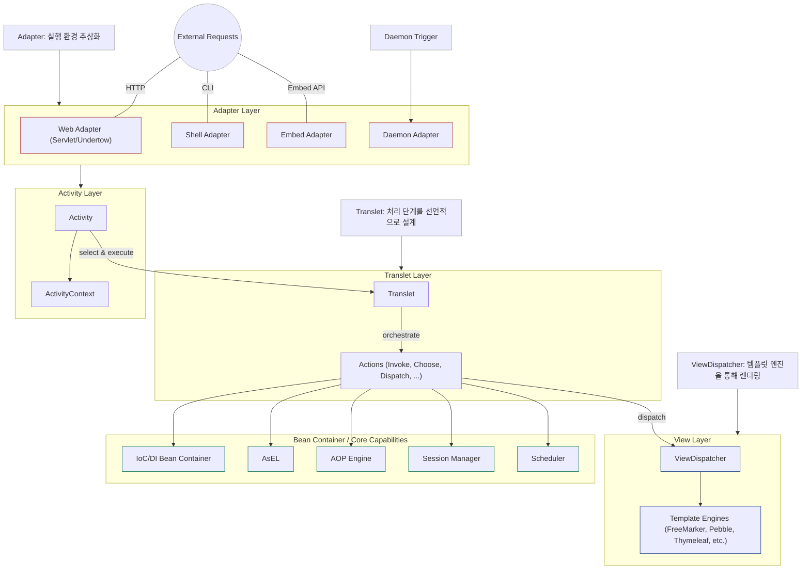
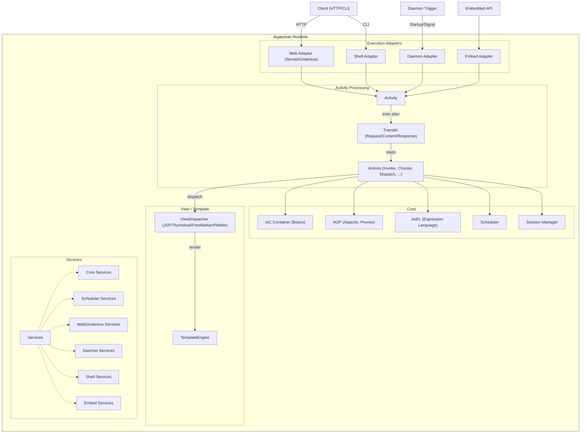
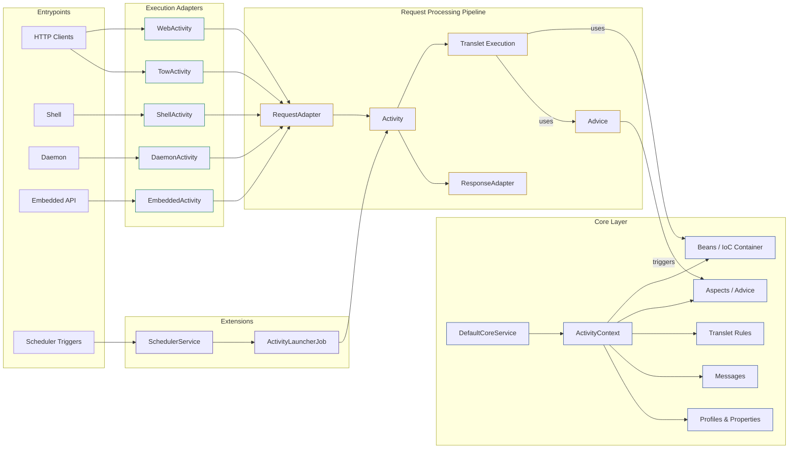
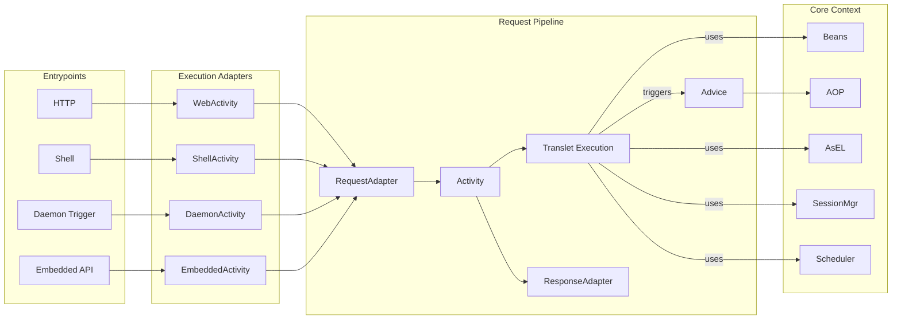
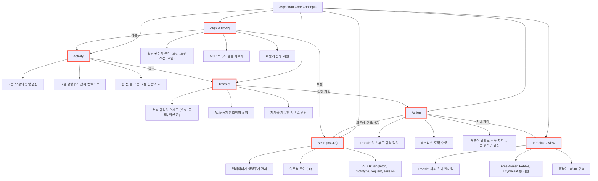
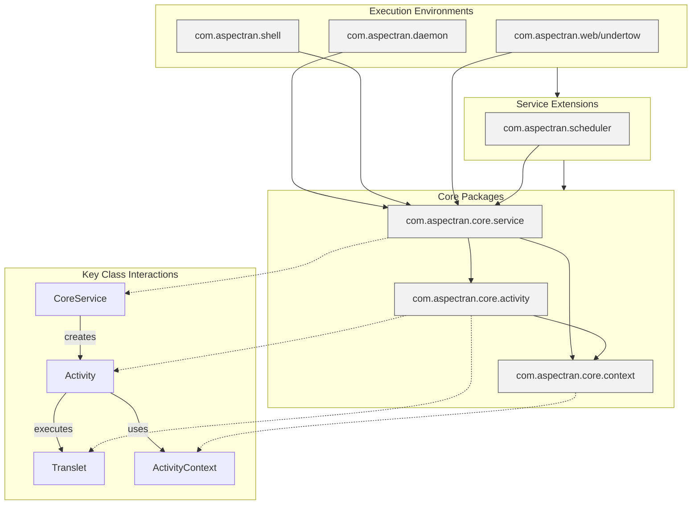
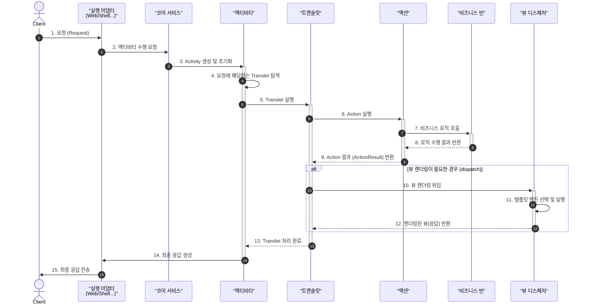
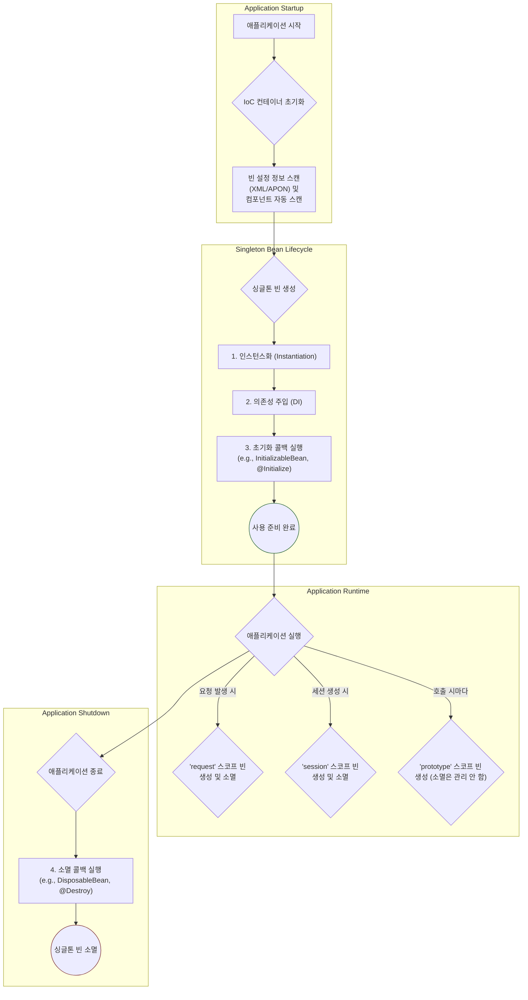
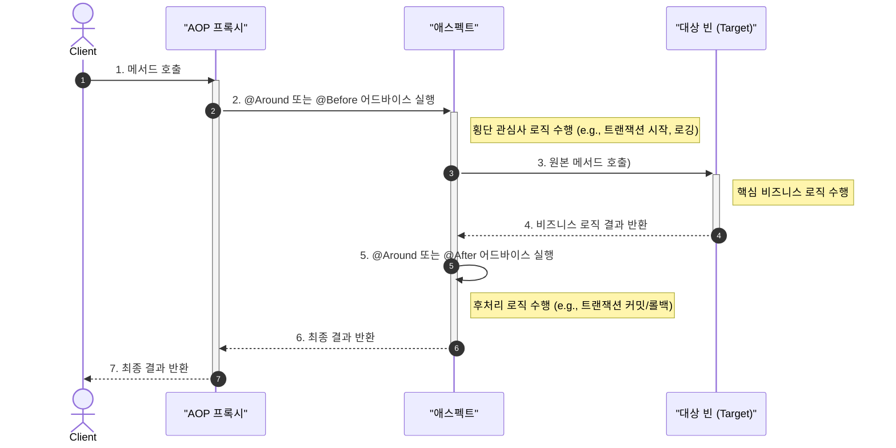

Aspectran의 아키텍처를 다양한 관점에서 표현한 다이어그램입니다. 각 다이어그램은 시스템의 특정 측면을 강조하여 전체 구조를 이해하는 데 도움을 줍니다.

- **어댑터 (Adapters)**: 실행 환경(웹, 셸, 데몬 등)의 차이를 추상화하고, 일관된 방식으로 요청을 `Activity`로 전달합니다.
- **액티비티 (Activity)**: 요청의 생명주기를 관리하는 실행 엔진입니다. `Translet`에 정의된 처리 단계를 순서대로 실행합니다.
- **트랜슬릿 (Translet)**: 요청을 처리하는 규칙의 집합입니다. 어떤 `Action`을 실행하고, 결과를 어떻게 `View`로 보낼지 등을 정의합니다.
- **액션 (Actions)**: 실제 비즈니스 로직을 수행하는 단위입니다. `Bean`을 호출하거나 데이터베이스와 상호작용합니다.
- **코어 컴포넌트 (Core Components)**: `Bean` 컨테이너, AOP 엔진, AsEL(표현 언어), 세션 관리자, 스케줄러 등 핵심 기능을 제공합니다.
- **뷰 (View)**: `Action`의 처리 결과를 사용자에게 보여주는 부분입니다. `JSP`, `Thymeleaf` 등 다양한 템플릿 엔진을 지원합니다.
- **서비스 (Services)**: 특정 실행 환경이나 기능을 캡슐화하여 코어와 유기적으로 통합되는 모듈입니다.

---

### 1. 모듈화 계층형 아키텍처 (Modular Layered Architecture)

Aspectran의 전체 구성 요소를 계층별로 나누어 표현한 다이어그램입니다. 외부 요청이 어댑터를 통해 어떻게 코어 기능과 연결되는지 보여줍니다.

---

### 2. 계층 구조 상세 (Detailed Layered Structure)

`Aspectran Runtime` 내부의 주요 컴포넌트 그룹과 그들 간의 상호작용을 더 상세하게 보여주는 다이어그램입니다.

---

### 3. 파이프라인 중심 뷰 (Pipeline-Centric View)

요청이 들어와서 응답이 나갈 때까지의 처리 과정을 파이프라인 형태로 표현한 다이어그램입니다. 데이터 흐름과 주요 처리 단계를 중심으로 아키텍처를 보여줍니다.

---

### 4. 파이프라인 축약 뷰 (Simplified Pipeline View)

파이프라인 뷰를 더 간략하게 표현한 다이어그램입니다. 핵심 처리 흐름을 빠르게 파악하는 데 유용합니다.

---

### 5. 핵심 개념 맵 (Core Concept Map)

Aspectran을 구성하는 가장 중요한 5가지 개념(Activity, Translet, Bean, Action, Aspect)과 뷰(Template)의 관계를 도식화한 다이어그램입니다.

---

### 6. 코어 패키지 관계 (Core Package Relationships)

주요 패키지 간의 의존성 관계를 보여주는 다이어그램입니다. 상위 레벨의 실행 환경이 어떻게 코어 패키지에 의존하는지 구조를 파악할 수 있습니다.

이 다이어그램들은 Aspectran의 설계 사상과 내부 작동 방식을 이해하는 데 유용한 가이드가 될 것입니다.

---

### 7. 요청 생명주기 시퀀스 (Request Lifecycle Sequence)

사용자 요청이 발생했을 때부터 최종 응답이 전달될 때까지, 주요 컴포넌트 간의 상호작용을 시간 순서에 따라 보여주는 다이어그램입니다.

---

### 8. 빈 생명주기 및 스코프 (Bean Lifecycle & Scopes)

IoC 컨테이너가 빈(Bean)을 생성하고 관리하는 전체 과정을 보여줍니다. `singleton` 빈의 생명주기와 `request`, `session`, `prototype` 스코프 빈이 언제 생성되고 소멸하는지 설명합니다.

---

### 9. AOP 작동 방식 (AOP Mechanism)

메서드 호출이 AOP 프록시에 의해 가로채여, 트랜잭션, 로깅 등 횡단 관심사를 처리하는 어드바이스(Advice)가 실행되는 과정을 보여줍니다.

이 다이어그램들은 Aspectran의 설계 사상과 내부 작동 방식을 이해하는 데 유용한 가이드가 될 것입니다.
