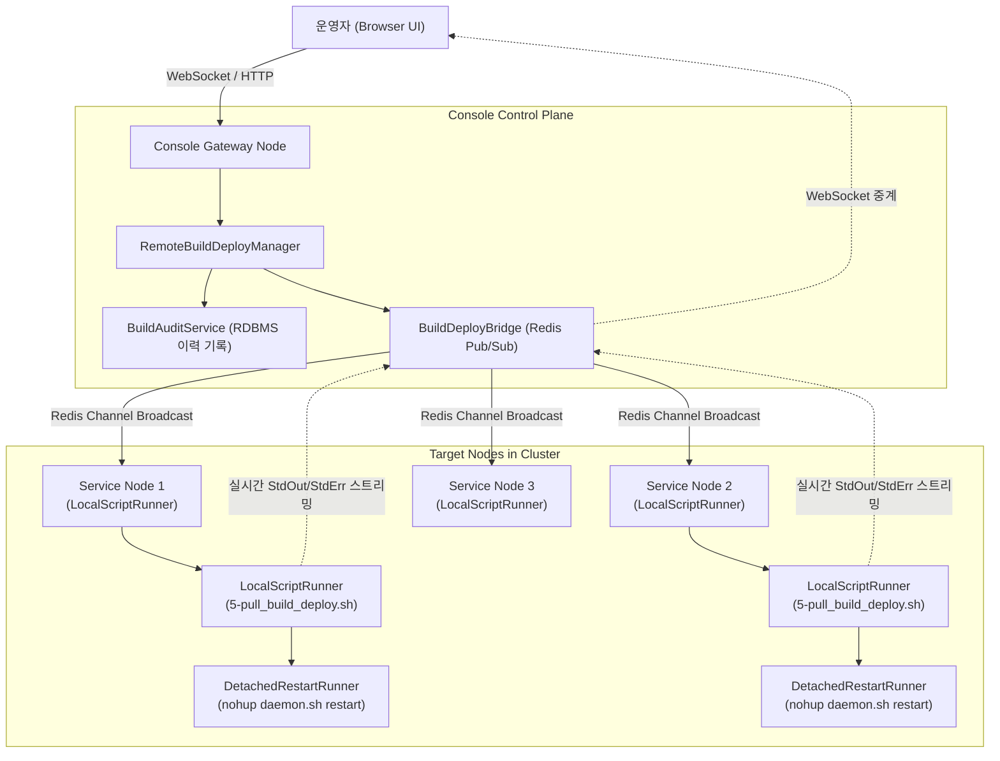

## 1. 개요 및 원격 빌드·배포 아키텍처

Aspectow Console의 **Build & Deployment** 모듈은 분산/클러스터 환경에서 가동 중인 Aspectran 애플리케이션의 지속적 배포(CD)와 무중단 라이프사이클 관리를 웹 인터페이스에서 원스톱으로 제공하는 강력한 제어 평면(Control Plane)입니다.

기존 엔터프라이즈 환경에서는 원격 서버에 소스를 배포하거나 설정을 변경하기 위해 Jenkins, GitLab CI 등의 외부 도구를 구성하거나, 운영자가 직접 대상 서버에 SSH로 접속하여 쉘 스크립트를 수동 실행해야 했습니다. Aspectow Console은 별도의 복잡한 외부 배포 도구 없이도 **콘솔 웹 UI를 통해 클러스터 전체 또는 지정된 노드 그룹을 대상으로 Git 소스 패치, Maven 컴파일, 정적 자산 및 설정 배포, 프로세스 독립적 서버 안전 재시작까지 한 번의 클릭으로 오케스트레이션**할 수 있습니다.



### 통합 원격 배포 아키텍처



### 핵심 컴포넌트

*   **`RemoteBuildDeployManager`**: 관리자의 배포 요청을 수신하여 고유한 `Execution ID`를 발급하고, 클러스터 토폴로지에 따라 대상 노드를 선별하여 비동기 실행 명령을 분배 및 총괄 조율합니다.
*   **`LocalScriptRunner`**: 각 개별 노드에서 물리적으로 구동되며, 대상 쉘 스크립트(`*.sh` 또는 `*.bat`)를 안전하게 프로세스로 기동하고 실시간 출력(StdOut, StdErr) 스트림을 인터셉트하여 메시지 브릿지로 전달합니다.
*   **`DetachedRestartRunner`**: 부모 JVM 프로세스가 종료되더라도 자식 프로세스가 영향을 받지 않고 백그라운드에서 살아남아 서버를 정상 재기동할 수 있도록 OS 세션과 프로세스 그룹을 완전히 분리하여 실행합니다.
*   **`BuildDeployBridge` (`WebsocketBuildDeployBridge` & `BuildMessageBridgeHandler`)**: Redis Pub/Sub 채널과 가상 웹소켓 중계를 활용하여 다중 노드에서 동시 다발적으로 쏟아지는 터미널 로그를 단일 콘솔 화면으로 지연 없이 실시간 브로드캐스팅합니다.
*   **`BuildAuditService`**: 모든 빌드/배포 실행 이력, 실행자 계정, 타겟 노드, Git 브랜치, 변경 전/후 Git 커밋 해시(Commit SHA), 실행 시간, 종료 코드(Exit Code) 및 전체 터미널 로그를 데이터베이스에 영구 보존합니다.

## 2. 배포 대상(Target Scope) 선택 전략

Aspectow Console의 배포 화면 상단 **Target Node** 선택기를 통해 배포가 적용될 범위를 정밀하게 지정할 수 있습니다.

| 대상 유형 (Target Type) | 적용 범위 | 권장 활용 시나리오 |
| :--- | :--- | :--- |
| **All Service Nodes** (기본값) | 콘솔 역할을 제외한 클러스터 내 모든 비즈니스 서비스 노드 | 일반적인 비즈니스 애플리케이션 전체 정기 배포 및 설정 업데이트 |
| **All Nodes in Cluster** | 콘솔 노드를 포함한 클러스터 전체 노드 | 프레임워크 코어 버전 업그레이드, 전사 공통 설정 전파 등 클러스터 전면 배포 |
| **Specific Group** | 지정된 논리적 그룹(`groupId`)에 속한 노드군 (예: `api-group`, `batch-group`) | 특정 서비스 역할을 수행하는 서버군만 선별하여 배포할 때 |
| **Individual Node** | 클러스터 내 지정된 단일 서버 노드 | 카나리(Canary) 릴리즈, 신규 기능 단일 노드 사전 검증, 특정 장애 노드 복구 |

## 3. 표준 배포 파이프라인 및 스크립트 구성

Aspectow는 소스 코드 동기화부터 컴파일, 설정 배포, 웹 애플리케이션 자산 반영까지의 전 과정을 9개의 표준화된 스크립트로 모듈화하여 제공합니다. Console의 **Execution Action / Script** 드롭다운에서 필요한 파이프라인을 선택할 수 있습니다.

```text
┌─────────────────────────────────────────────────────────────────────────────────┐
│                           5-pull_build_deploy.sh                                │
│                                                                                 │
│   ┌──────────────┐     ┌──────────────┐     ┌──────────────┐     ┌──────────┐   │
│   │ 1. Git Pull  │ ──> │ 2. Build     │ ──> │ 3. Deploy    │ ──> │ 4. Deploy│   │
│   │ (1-pull.sh)  │     │ (2-build.sh) │     │    Config    │     │  Webapps │   │
│   └──────────────┘     └──────────────┘     └──────────────┘     └──────────┘   │
└─────────────────────────────────────────────────────────────────────────────────┘
```

### 표준 스크립트 상세 명세

| 스크립트 파일명 | 파이프라인 분류 | 설명 및 동작 흐름 |
| :--- | :--- | :--- |
| **`5-pull_build_deploy.sh`** | 🚀 Standard (권장) | **Full Build & Deploy**: 원격 저장소 Git Pull → Maven 컴파일 & 패키징 → `app/config` 배포 → `app/webapps` 배포의 전 과정을 일괄 실행합니다. |
| **`6-pull_deploy.sh`** | 🚀 Standard (고속) | **Fast Deploy**: Maven 재컴파일 단계를 건너뛰고, Git Pull 후 템플릿/정적 자산 및 설정 파일만 즉시 배포합니다. |
| **`1-pull.sh`** | ⚙️ Single Step | **Git Pull Only**: 소스 코드 저장소로부터 최신 커밋 및 브랜치/태그 변경 사항만 가져옵니다. |
| **`2-build.sh`** | ⚙️ Single Step | **Maven Build Only**: Maven을 실행하여 소스 코드를 컴파일하고 배포 라이브러리(`.jar`)를 패키징합니다. |
| **`3-deploy_config.sh`** | ⚙️ Single Step | **Config Deploy Only**: `.build` 공간의 최신 설정 파일들을 실행 환경의 `app/config`로 배포하고 `app-restore/` 설정을 복구합니다. |
| **`4-deploy_webapps.sh`** | ⚙️ Single Step | **Webapps Deploy Only**: `.build` 공간의 웹 애플리케이션 파일들을 실행 환경의 `app/webapps`로 배포합니다. |
| **`7-pull_deploy_config_only.sh`** | 🛠️ Selective Deploy | **Pull & Deploy Config**: 최신 Git 변경 사항을 가져온 후 설정 파일(`app/config`)만 선별 배포합니다. |
| **`8-pull_deploy_webapps_only.sh`** | 🛠️ Selective Deploy | **Pull & Deploy Webapps**: 최신 Git 변경 사항을 가져온 후 웹 애플리케이션(`app/webapps`)만 선별 배포합니다. |
| **`9-pull_deploy_config_webapps_only.sh`** | 🛠️ Selective Deploy | **Pull & Deploy Config + Webapps**: 컴파일 없이 최신 소스 동기화 후 설정과 웹앱 파일만 함께 배포합니다. |
{: .text-nowrap}

> **Tip (Pipeline Flow Preview)**: Console 화면에서 스크립트를 선택하면 하단에 **Pipeline Flow** 카드가 활성화되어 해당 스크립트가 내부적으로 거치는 단계(예: `1. Git Pull` → `2. Maven Build` → `3. Config Deploy` → `4. Webapps Deploy`)를 시각적 배지로 미리 확인할 수 있습니다.



## 4. Git Branch 및 Release Tag 지정 배포 전략

운영 환경에서는 불변(Immutable) 상태인 정기 릴리즈 버전 태그(예: `v1.2.0`)를 배포하거나, 긴급 결함 조치를 위한 핫픽스 브랜치(예: `hotfix/auth-patch`)를 신속하게 배포해야 합니다.

### 브랜치 / 태그 지정 배포 방법

Console 화면의 **Git Branch / Tag (Optional)** 입력란에 원하는 Git 레퍼런스를 입력하고 배포를 실행합니다.

```bash
# 입력 예시
main                 # 기본 메인 브랜치 최신 커밋 배포
release/v2.1.0       # 릴리즈 준비 브랜치 배포
v2.1.0               # 특정 정기 릴리즈 태그 배포 (권장)
hotfix/security-fix  # 긴급 패치 브랜치 배포
a1b2c3d4             # 특정 커밋 해시(Commit SHA) 고정 배포
```



### 안전한 Ref 사전 검증 (Safe Ref Validation)

Aspectow의 배포 스크립트는 작업 트리의 손상을 방지하기 위해 정교한 사전 검증 로직을 내장하고 있습니다.

1.  **원격 메타데이터 갱신**: `git fetch --all --tags --prune`을 실행하여 최신 브랜치 및 태그 목록을 동기화합니다.
2.  **레퍼런스 유효성 검증**: 입력된 이름이 로컬 태그(`refs/tags/*`), 로컬 브랜치(`refs/heads/*`), 원격 트래킹 브랜치(`origin/*`), 또는 유효한 커밋 해시인지 `git rev-parse --verify`로 사전 검증합니다.
3.  **오류 사전 차단**: 사용자가 오타 등으로 존재하지 않는 브랜치나 태그명을 입력한 경우, 기존 로컬 작업 트리를 전혀 변경하지 않고 즉시 스크립트를 중단(`exit 1`)하며 `[ERROR] Branch, tag, or commit '...' not found in repository.` 메시지를 출력합니다.
4.  **UI 즉시 피드백**: Console 웹 화면에도 즉시 `FAILED` 상태와 에러 요약이 빨간색 뱃지로 표시되어 잘못된 배포 시도로 인한 시스템 장애를 사전에 방지합니다.

## 5. 실시간 인터랙티브 웹 터미널 활용

Aspectow Console은 원격 노드에서 실행되는 쉘 스크립트의 표준 출력(StdOut)과 표준 에러(StdErr)를 웹소켓을 통해 실시간으로 스트리밍하는 인터랙티브 다크 터미널을 제공합니다.



### 5.1. 실시간 ANSI 컬러 파싱 및 렌더링
스크립트 실행 중 출력되는 ANSI 이스케이프 색상 코드(성공 초록색, 실패 빨간색, 경고 노란색, 정보 파란색 등)를 브라우저 상에서 실시간으로 파싱하여 가독성 높은 컬러 터미널 화면을 제공합니다.

### 5.2. 다중 노드 탭 UI (Multi-Node Tabs)
클러스터 내 여러 노드를 대상으로 배포를 실행하면, 터미널 상단에 **Dynamic Node Tabs Bar**가 자동 구성됩니다.

*   **All Nodes 탭**: 클러스터 전체 노드에서 출력되는 로그를 각 노드 식별자 태그(`[node1]`, `[node2]`)와 함께 하나의 타임라인으로 통합 출력합니다. 전체 진행 흐름을 한눈에 파악할 때 유용합니다.
*   **개별 노드 탭 (`[node1]`, `[node2]` 등)**: 특정 노드의 탭을 클릭하면 해당 노드의 출력 스트림만 독립적으로 필터링하여 집중 관찰할 수 있습니다. 각 탭 우측에는 해당 노드의 실시간 상태(`RUNNING`, `SUCCESS`, `FAILED`) 뱃지가 동적으로 갱신됩니다.

### 5.3. 실시간 실행 메타데이터 추적
화면 좌측의 **Current Execution** 카드에는 다음 정보가 실시간으로 집계 및 표시됩니다.
*   **Execution ID**: 고유 실행 식별 번호 (예: `exec-1724729100-node1`)
*   **Git Branch / Tag**: 실행 시 적용된 브랜치 또는 태그명
*   **Before Commit / After Commit**: 배포 전 커밋 해시와 배포 후 적용된 최신 커밋 해시(8자리)
*   **Started At & Duration**: 시작 시각 및 0.1초 단위의 실시간 소요 시간 티커
*   **Exit Code**: 프로세스 최종 종료 코드 (`0`: 성공, `1` 이상: 실패)

### 5.4. 터미널 편의 기능
*   **Auto-scroll 토글**: 대량의 로그가 빠르게 출력될 때 터미널 맨 아래로 자동 스크롤할지 여부를 체크박스로 제어합니다.
*   **Clear Terminal**: 현재 탭의 화면 출력 내용을 깨끗하게 비웁니다.
*   **Download Logs**: 현재 탭에 출력된 전체 터미널 텍스트 로그를 `build-{nodeId}-{execId}.log` 파일로 로컬 PC에 즉시 다운로드합니다.
*   **Abort / Cancel (실행 취소)**: 실행 중인 배포 작업을 강제로 중단해야 할 경우 `Abort / Cancel` 버튼을 클릭하여 원격 노드의 실행 프로세스에 안전한 취소 시그널을 전송합니다.

## 6. 프로세스 독립적 안전 재시작 메커니즘 (Detached Server Restart)

빌드 및 배포가 완료된 후 애플리케이션을 즉시 재시작해야 할 때, 일반적인 원격 쉘 실행 방식은 부모 프로세스(기존 JVM)가 종료되면서 자식 프로세스까지 함께 시그널을 받아 강제 종료되는 치명적인 문제가 발생할 수 있습니다.

Aspectow Console은 이를 완벽히 해결하기 위해 **[`DetachedRestartRunner`](file:///home/aspectran/projects/public/aspectow/console/src/main/java/com/aspectran/aspectow/console/build/manager/DetachedRestartRunner.java)** 메커니즘을 내장하고 있습니다.

```text
┌─────────────────────────────────────────────────────────────────────────────────┐
│                           Detached Restart Flow                                 │
│                                                                                 │
│   1. Console Web      ──> [DetachedRestartRunner]                               │
│      Trigger Restart                                                            │
│                                │                                                │
│                                ▼                                                │
│   2. Detach Process   ──> nohup sh -c 'sleep 1 && exec daemon.sh restart'       │
│      from Parent JVM       (Redirect StdIn/StdOut/StdErr to /dev/null)          │
│                                │                                                │
│                                ▼                                                │
│   3. Parent JVM       ──> Flush final WebSocket status -> Graceful Shutdown     │
│                                │                                                │
│                                ▼                                                │
│   4. Detached Child   ──> Survives JVM shutdown -> Starts new Daemon Process    │
│      Process                                                                    │
└─────────────────────────────────────────────────────────────────────────────────┘
```

### 주요 동작 원리

1.  **OS 프로세스 세션 분리 (Detached Process Group)**:
    - **Linux/Unix**: `nohup sh -c 'sleep 1 && exec "./daemon.sh" restart'` 명령을 통해 부모 JVM의 프로세스 그룹에서 완전히 독립된 자식 프로세스로 분리 생성합니다.
    - **Windows**: `cmd.exe /c start "" /b daemon.bat restart` 백그라운드 프로세스로 분리 실행합니다.
2.  **WebSocket 알림 전송 보장 (`sleep 1` Flush Delay)**:
    - 프로세스 분리 직후 1초의 지연 시간을 두어, 부모 JVM이 완전히 정지되기 전에 "재시작 프로세스가 백그라운드에서 정상 기동되었습니다"라는 최종 상태 메시지를 웹소켓을 통해 브라우저 클라이언트로 완전히 전송(Flush)할 수 있도록 보장합니다.
3.  **I/O 디스크립터 정리 (Null Device Isolation)**:
    - 자식 프로세스의 표준 입력, 표준 출력, 표준 에러를 `/dev/null`(Windows의 경우 `NUL`)로 리다이렉션하여, 부모 프로세스의 입출력 파이프가 닫혀 자식 프로세스가 `SIGPIPE`나 입출력 블로킹으로 중단되는 현상을 방지합니다.

## 7. 다중 노드 빌드 락 및 동시성 제어 (Build Concurrency Control)

단일 머신에서 여러 인스턴스(멀티 노드)를 구동 중이거나 공유 파일 시스템을 사용하는 환경에서, 클러스터 전체 노드(`All Nodes`)를 대상으로 동시에 풀빌드(`5-pull_build_deploy.sh`) 명령을 내리면 동일한 `.build` 작업 디렉터리에 여러 프로세스가 동시에 접근하여 `index.lock` 충돌이나 Maven 파일 삭제 실패 에러가 발생할 수 있습니다.

Aspectow는 이를 방지하기 위해 **원자적 빌드 락 및 빌드 결과물 재사용 메커니즘**을 내장하고 있습니다.

1.  **원자적 파일 락 (`.build.lock`, `.pull.lock`)**:
    - 가장 먼저 진입한 노드가 작업 공간에 원자적 파일 락을 획득하고 Git Pull 및 Maven 빌드를 주도적으로 실행합니다.
2.  **안전한 대기 (Lock Wait)**:
    - 동시에 진입한 다른 노드들은 `[BUILD LOCK] Another node is currently building... Waiting for completion...` 메시지를 출력하며 선행 노드의 빌드가 완료될 때까지 안전하게 대기합니다.
3.  **중복 빌드 자동 스킵 및 산출물 재사용 (Build Reuse)**:
    - 선행 노드가 Maven 패키징을 성공(`BUILD SUCCESS`)하면, 대기 중이던 노드들은 불필요한 중복 컴파일을 건너뛰고(`Skipping redundant Maven compilation.`) 직전 빌드 산출물을 그대로 가져와 즉시 배포 단계로 진입합니다.
    - 이를 통해 파일 경합 에러가 원천 방지되며, 클러스터 전체 배포 소요 시간이 획기적으로 단축됩니다.

## 8. 장애 진단 및 실시간 데몬 로그 뷰어 (Troubleshooting)

배포 중 빌드 에러가 발생하거나, 서버 재시작 후 정상 기동되지 않을 때 터미널 우측 상단의 **Daemon Logs** 드롭다운 메뉴를 통해 대상 노드의 데몬 로그를 즉시 확인할 수 있습니다.



*   **`daemon-stderr.log`**: JVM 초기화 오류, OutOfMemoryError, ClassNotFoundException 등 비정상 종료 시 기록되는 표준 에러 로그의 최근 200줄을 실시간 조회합니다.
*   **`daemon-stdout.log`**: 애플리케이션 기동 로그, Aspectran 컨텍스트 로딩 로그 등 표준 출력 로그를 실시간 조회합니다.

### 주요 문제 해결 가이드

| 증상 / 에러 메시지 | 원인 분석 | 조치 방법 |
| :--- | :--- | :--- |
| `[ERROR] Branch, tag, or commit '...' not found` | 원격 Git 저장소에 존재하지 않는 브랜치/태그명 입력 | 브랜치 및 태그 철자를 확인하고 다시 입력합니다. |
| `[ERROR] Maven build failed with exit code 1` | 소스 코드 컴파일 오류, 단위 테스트 실패 또는 의존성 다운로드 실패 | Console 터미널의 에러 로그를 확인하거나, 해당 노드의 `.build/[APP_NAME]` 경로에서 `mvn clean package`를 직접 실행하여 상세 원인을 파악합니다. |
| `[BUILD TIMEOUT] Script execution timed out` | 대용량 의존성 다운로드 지연 등으로 설정된 타임아웃 초과 | 네트워크 상태를 점검하고, 스크립트를 재실행하거나 `LocalScriptRunner`의 타임아웃 설정을 조정합니다. |
| 배포 후 서버 응답 없음 (`DEAD` 상태) | 포트 충돌, DB 연결 실패, 잘못된 프로퍼티 설정으로 인한 기동 실패 | 터미널 상단의 **Daemon Logs → daemon-stderr.log**를 조회하여 JVM 부팅 에러 스택트레이스를 분석합니다. |
{: .text-nowrap}

## 9. 규정 준수 빌드 감사 이력 (Build Audit Trail & Compliance)

Aspectow Console은 엔터프라이즈 보안 및 규정 준수(Compliance) 요건을 완벽히 충족하기 위해, 수행된 모든 빌드 및 배포 작업의 이력을 RDBMS에 영구 보존하며 암호학적 무결성 검증을 제공합니다.

화면 우측 상단의 **Audit Trail** 버튼을 클릭하면 **Build Audit Trail** 전용 감사 팝업 창(`cluster/build/audit/`)이 호출됩니다.



### 9.1. 감사 데이터 항목 및 보존 명세

모든 배포 작업은 완료 시점에 다음과 같은 감사 속성 세트가 데이터베이스(`BuildHistoryMapper`)에 불변(Immutable) 레코드로 저장됩니다.

*   **Execution ID**: 배포 작업 고유 식별자 (`bld_...` 형식)
*   **Target Node & Requester**: 배포를 실행한 대상 노드 ID 및 요청 관리자 계정명
*   **Script Name & Parameters**: 실행된 배포 스크립트명 및 파라미터(브랜치/태그 등)
*   **Git Commit Before / After**: 배포 전 적용되어 있던 Git 커밋 해시와 배포 후 갱신된 최신 커밋 해시
*   **Git Branch & Commit Message**: 체크아웃된 브랜치명 및 최신 커밋 메시지
*   **Status & Exit Code**: 최종 실행 상태(`SUCCESS`, `FAILED`, `CANCELLED`, `TIMEOUT`) 및 프로세스 종료 코드
*   **Started / Finished Time & Duration**: 실행 시작/종료 타임스탬프 및 0.01초 단위의 정확한 소요 시간
*   **SHA-256 Integrity Digest**: 감사 데이터와 실행 로그 전문에 대한 SHA-256 암호학적 해시값
*   **Full Terminal Output Logs**: 실행 당시 출력되었던 전체 터미널 로그 스트림 전문

### 9.2. 감사 인터페이스 및 주요 기능

*   **다차원 검색 및 필터 패널 (Filter Panel)**:
    *   **Target Node**: 클러스터 내 특정 노드 또는 전체 노드로 필터링.
    *   **Status**: `SUCCESS`, `FAILED`, `RUNNING`, `CANCELLED` 상태별 조회.
    *   **Keyword Search**: Execution ID, 스크립트명, 커밋 해시, 실행자 계정명 등 통합 키워드 검색.
*   **보고서 인쇄 및 데이터 내보내기 (Export & Print)**:
    *   **Export CSV Report**: 현재 설정된 검색 필터가 적용된 전체 감사 이력을 스프레드시트 호환 CSV 파일로 즉시 다운로드하여 내부 감사 및 결재 자료로 활용할 수 있습니다.
    *   **Print Report**: 브라우저 인쇄 대화상자를 호출하며, 내비게이션 바와 필터가 자동으로 숨겨지고 인쇄용 고대비 레이아웃으로 최적화된 감사 보고서를 출력합니다.
*   **실시간 빌드 콘솔 연동 (Go to Build Console)**:
    *   감사 목록의 Execution ID나 `Console` 액션 버튼을 클릭하면, 해당 배포 이력의 실행 컨텍스트를 유지한 채 실시간 빌드 콘솔 화면으로 즉시 전환되어 과거 실행 상황을 탐색할 수 있습니다.

### 9.3. Audit Verification Report (상세 검증 리포트 모달)

감사 테이블의 **Detail** 버튼을 클릭하면 해당 배포 작업의 무결성과 세부 정보를 검증하는 모달 창이 호출됩니다.



*   **암호학적 무결성 검증 (Integrity Proof)**:
    *   저장된 실행 메타데이터와 로그 전문의 SHA-256 해시를 실시간 재계산하여 DB 기록값과 대조합니다.
    *   위변조가 없는 경우 상단에 **`Cryptographically Valid & Untampered`** 녹색 인증 배너와 함께 SHA-256 Digest 해시값을 투명하게 공개합니다.
*   **상세 감사 내역 테이블**:
    *   Execution ID, 대상 노드, 스크립트명, 실행자, 실행 상태 및 종료 코드(Exit Code), 시작/종료 시각, 소요 시간, Git 브랜치, Before/After 커밋 해시, 커밋 메시지, 및 실행 실패 시 상세 에러 요약(Error Summary)을 제공합니다.

### 9.4. Console Output Stream (터미널 로그 뷰어 모달)

감사 테이블의 **Logs** 버튼을 클릭하면 해당 배포 작업 당시의 전체 터미널 출력을 확인할 수 있는 로그 모달 창이 호출됩니다.



*   **실시간 ANSI 컬러 터미널 복원**:
    *   데이터베이스에 영구 보존된 압축 로그 스트림을 실시간 복원하여 가독성 높은 다크 테마 터미널 화면으로 출력합니다.
*   **전체 로그 다운로드 (Download Full Log)**:
    *   하단의 `Download Full Log` 버튼을 클릭하여 당시의 전체 콘솔 텍스트 로그를 로컬 PC로 즉시 내려받아 상세 장애 분석 및 아카이빙에 활용할 수 있습니다.

## 10. 보안 및 역할 기반 권한 제어 (RBAC)

빌드 및 배포 기능은 시스템에 직접적인 영향을 미치는 고위험 제어 기능이므로, Aspectow Console의 역할 기반 접근 제어(RBAC) 시스템에 의해 엄격히 통제됩니다.

*   **`BUILD_VIEW` 권한**: 빌드 화면 및 과거 빌드 감사 로그를 조회할 수 있으나, 스크립트를 실행하거나 취소할 수 없습니다.
*   **`BUILD_EXECUTE` 권한**: 스크립트 실행(`Execute Script`), 퀵 액션(`Quick Run`), 실행 취소(`Abort / Cancel`) 등 모든 배포 명령을 행사할 수 있습니다.
*   **`SUPER_ADMIN` 역할**: 빌드 및 배포를 포함한 모든 콘솔 제어 권한을 완전하게 행사합니다.
*   **`DEMO` 역할**: 시스템 보호를 위해 데모 계정에서는 빌드 및 배포 스크립트 실행 버튼이 자동으로 비활성화(Disabled)되며 실행이 엄격히 차단됩니다.
