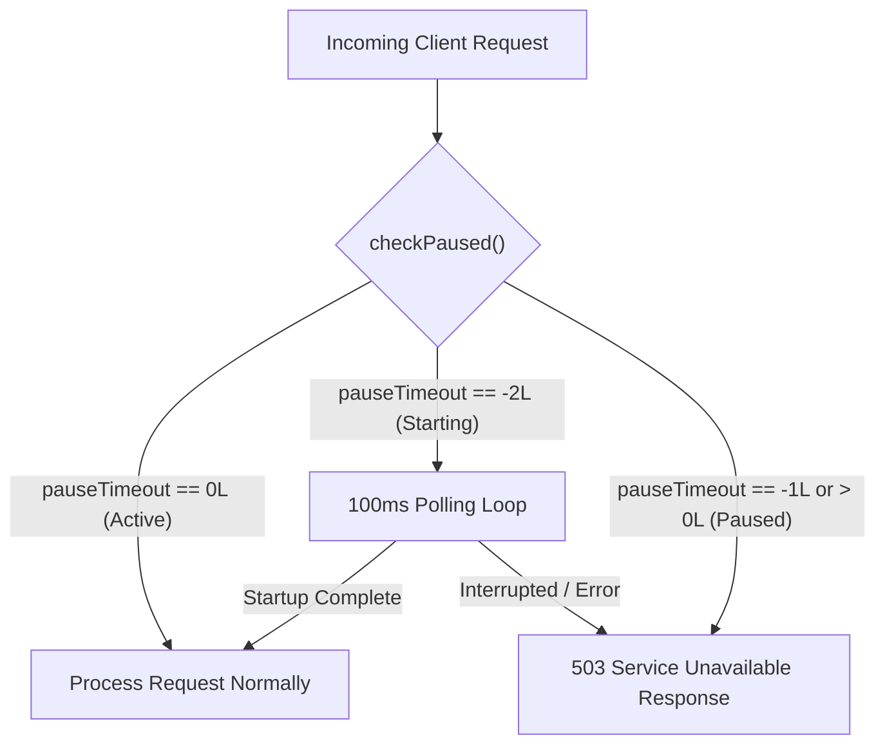
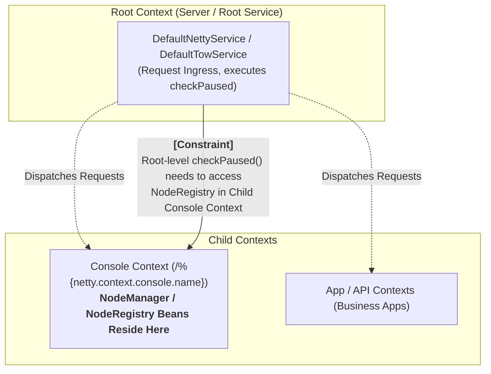
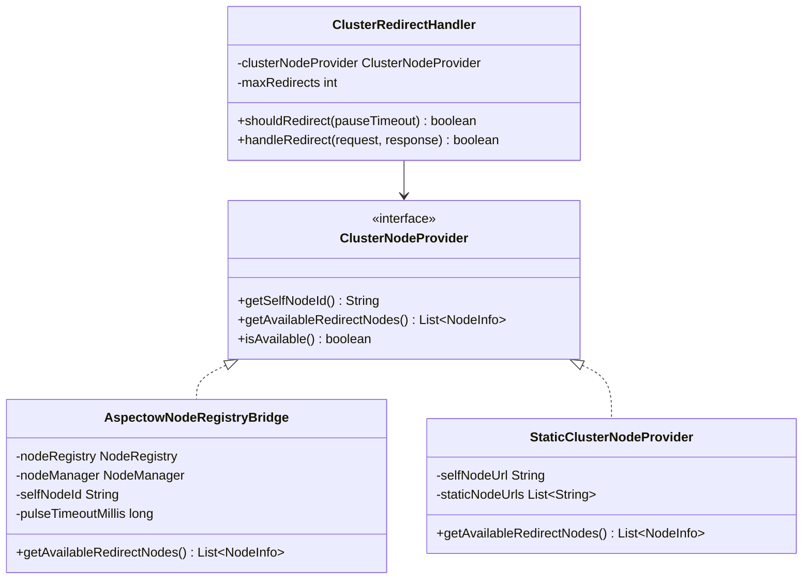
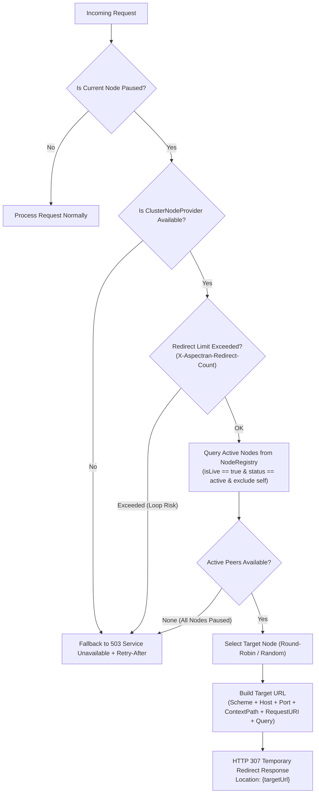


**Notice:** This document is an architectural design and research proposal shared to explore high availability (HA) and zero-downtime routing strategies in Aspectran and Aspectow cluster environments.
The architecture, designs, and implementation roadmap described herein represent early-stage conceptual planning. Actual implementation, timeline, and final specifications are not yet finalized and may be modified or canceled based on technical reviews and community feedback.



This document outlines the architectural design and phased implementation roadmap for safely redirecting incoming client requests to other active nodes within a cluster when a specific node transitions to a **Paused** state due to maintenance, rolling updates, deployments, or load balancing.

In particular, it analyzes and compares pause/quiesce mechanisms across commercial and open-source application servers, and details a decoupled bridging mechanism to access the `NodeManager` and `NodeRegistry` located in the **Console Child Context** from the top-level **Root Web Service Context** in the Aspectow cluster architecture.
<!--more-->

## 1. Overview and Background

Aspectran provides fine-grained lifecycle management across all web service engines (`DefaultServletWebService`, `DefaultTowService`, `DefaultNettyService`) and core services via `pause()`, `resume()`, and `pauseTimeout` mechanisms.



Currently, when a node is in a paused state (`pauseTimeout != 0L`), incoming requests are rejected with an HTTP `503 Service Unavailable` response along with a `Retry-After` header and informative message.

However, in multi-node clustered environments behind L4/L7 load balancers, this traditional approach presents several operational challenges:

* **Disrupted User Experience:** When a node is paused for rolling deployments or maintenance, requests that hit that node immediately receive a 503 error, surfacing error pages directly to end users.
* **Load Balancer Health Check Lag:** External load balancers typically have health check intervals ranging from several seconds to tens of seconds. In-flight requests arriving during this detection window fail without fallback.
* **Underutilized Cluster Capacity:** Even when numerous other active nodes in the cluster have ample capacity to process requests, traffic is rejected simply because the initial ingress node is paused.

This proposal aims to establish a self-routing, high-availability (HA) framework where a paused node **leverages the Aspectow Node Manager (`NodeRegistry`) to discover active peer nodes in real time and issues an HTTP 307 redirect** to seamlessly reroute client traffic without data loss.

## 2. Current Pause Architecture and Limitations

### 2.1. Current checkPaused Flow Across Web Engines

In Aspectran, each web runtime engine (`Servlet`, `Undertow`, `Netty`) evaluates `checkPaused` at the very beginning of request processing.



* **Limitations:**
  * Only performs isolated, node-level error responses (`503`), failing to distribute traffic across active peers.
  * Clients must manually retry or suffer unhandled browser/client errors.

## 3. Comparison with Commercial and Open-Source Application Servers

Enterprise application servers have historically tackled node maintenance and graceful shutdown through quiesce/suspend modes. We analyze how traditional WAS products handle this problem and contrast them with Aspectran's proposed architecture.

### 3.1. How Other Application Servers Handle Traffic Diversion

1. **Oracle WebLogic Server — Graceful Suspend & WebLogic Proxy Plugin:**
   * Transitioning a server to `SUSPEND` rejects new session requests while draining existing sessions.
   * Dedicated web server plugins (`mod_wl` for Apache/IIS) or `HttpClusterServlet` track cluster node states and perform **internal proxy forwarding (failover)** to route requests to active cluster instances.
2. **Red Hat WildFly / JBoss EAP — `mod_cluster`:**
   * Uses a dedicated management protocol (MCMP) between WildFly nodes and the frontend Apache httpd / Undertow reverse proxy.
   * When a node enters paused/disabled mode, it broadcasts a `DISABLE-APP` or `STOP-APP` message, prompting the frontend proxy to remove the node from the active pool and forward traffic to healthy peers.
3. **IBM WebSphere Application Server — Quiesce Mode & ODR (On Demand Router):**
   * When a node is quiesced, intelligent routers (ODR) or WebSphere Web Server Plugins detect the state change and route traffic to healthy nodes while preserving session affinity.
4. **Tmax JEUS — Graceful Down & WebtoB Integration:**
   * Running `jeusadmin suspend-server` notifies the dedicated WebtoB web server via IPC/TCP. WebtoB immediately ceases dispatching new requests to that JEUS engine and reroutes incoming traffic to sibling instances.

### 3.2. Structural Comparison: Traditional WAS vs. Aspectran

| Comparison Dimension | Traditional WAS (WebLogic, JEUS, WildFly, etc.) | Aspectran / Aspectow Proposal |
| :--- | :--- | :--- |
| **Routing Agent** | **Frontend proprietary plugins/web servers** (WebtoB, mod_cluster, mod_wl) | **Node itself (Netty, Undertow, Servlet engines)** |
| **Infrastructure Dependency** | Requires proprietary web server plugins installed upstream | Operates in **standalone, microservice, and containerized** environments |
| **State Discovery** | Proprietary multicast or dedicated management ports | Distributed synchronization via **Redis / NodeRegistry** |
| **Traffic Diversion Method** | Reverse proxy-level internal forwarding (ongoing server-to-server I/O) | Standard **HTTP 307 Temporary Redirect** (client resends directly to target) |
| **Resource Consumption on Paused Node** | Paused node remains engaged as a relay proxy or relies on external plugins | Paused node closes socket immediately after a lightweight 307 response (**Zero overhead drain**) |

### 3.3. Key Advantages of Aspectran's Approach

* **Zero Proprietary Infrastructure Lock-In:** Operates seamlessly behind standard L4 load balancers, generic reverse proxies (Nginx, Envoy, AWS ALB), or even direct-to-node ingress configurations.
* **Ultra-Lightweight Perfect Drain via HTTP 307:** Unlike proxy forwarding, returning a compact 307 header and closing the socket allows the paused node to instantly release memory and CPU, achieving a true resource drain.
* **Cloud-Native and Microservices Ready:** Tailored for Docker/Kubernetes pod lifecycles where independent nodes autonomously participate in cluster self-routing via distributed registries.

## 4. Aspectow Cluster Topology and Context Hierarchy Constraints

### 4.1. Aspectow NodeManager and NodeRegistry Architecture

Aspectow orchestrates node lifecycles, metadata, heartbeat pulses, groups, and communication endpoints through its core `NodeManager` and `NodeRegistry` components.

* **Core Responsibilities of `NodeRegistry`:**
  * Manages cluster metadata (`NodeInfo`) and pulse timestamps in Redis hashes (`aspectow:cluster:nodes`, `pulses`, `groups`).
  * `getNodes()`, `getNodeInfo(nodeId)`, `getNodesByGroup(groupId)`: Retrieves node descriptors and communication endpoints (`EndpointConfig`).
  * `isLive(nodeId, timeoutMillis)`: Validates active node liveness based on pulse timestamps.
  * `hasOtherNodesInGroup(groupId, excludeNodeId)`: Verifies whether healthy sibling nodes exist within the same group.

### 4.2. Context Hierarchy Constraints

The multi-context model in Aspectow introduces an architectural boundary:



* **Core Constraints:**
  1. **Location Mismatch:** `NodeManager` and `NodeRegistry` beans are initialized in and managed by the child `console` context (`netty-context-console.xml`, `tow-context-console.xml`).
  2. **Execution Point:** The first component to receive raw HTTP requests and evaluate `checkPaused()` is the top-level **Root Web Service (`DefaultNettyService`, `DefaultTowService`, `DefaultServletWebService`)**.
  3. **Dependency Inversion:** A parent (Root) context should not statically depend on child (Console) beans. A decoupled bridge mechanism is required to let Root services access the child's `NodeRegistry`.

## 5. Architectural Solution and Component Design

### 5.1. Decoupled Root-to-Console NodeRegistry Bridge

We establish a Service Provider Interface (SPI) to bridge the Root web service and child Console context without tight coupling:



#### Approach 1: Service Attribute Dynamic Binding (Recommended)
When the `console` context initializes and instantiates `NodeManager`, it registers an `AspectowNodeRegistryBridge` into its parent service (`getParentService().setAttribute()`).

```java
// Console Context initialization (e.g., NodeManagerFactoryBean)
CoreService parentService = activityContext.getCoreService().getParentService();
if (parentService != null) {
    AspectowNodeRegistryBridge bridge = new AspectowNodeRegistryBridge(nodeManager);
    parentService.setAttribute(ClusterNodeProvider.ATTRIBUTE_NAME, bridge);
}
```

* **Advantages:**
  * Root context remains completely decoupled from Aspectow modules, interacting only through the clean `ClusterNodeProvider` SPI.
  * In standalone environments where the Console context is not loaded, the system smoothly falls back to static node lists (`StaticClusterNodeProvider`).

#### Approach 2: Child Context Traversal
During `checkPaused()`, the Root service inspects its active child services to dynamically locate `NodeManager` or `NodeRegistry` beans.

#### Approach 3: Shared Singleton Holder
Registers the registry into a JVM-scoped `NodeRegistryHolder.set(nodeRegistry)` accessible across context hierarchies.

### 5.2. HTTP 307 Temporary Redirect Routing Mechanism

When a paused node detects incoming traffic, it issues an `HTTP 307 Temporary Redirect`:



* **Why HTTP 307?**
  * `302 Found` historically caused HTTP clients to rewrite `POST` requests to `GET`, dropping the request body.
  * `307 Temporary Redirect` (RFC 7231 / RFC 9110) mandates that clients **must preserve the original HTTP method (`GET`, `POST`, `PUT`, `DELETE`) and request body intact** when following the redirect.
  * Ensures zero data loss for file uploads, JSON payloads, and REST API calls.

* **Response Headers:**
  * `Location`: Target absolute URL (`https://node2.example.com:8080/path?query`)
  * `X-Aspectran-Redirect-Count`: Incremental hop counter
  * `X-Aspectran-Redirected-From`: Source Node ID
  * `Connection`: `close`

### 5.3. Active Node Filtering and Selection Criteria

The bridge selects candidates from `NodeRegistry` using strict health checks:

1. **Self-Exclusion:** Excludes the current node (`nodeInfo.getId().equals(nodeManager.getNodeId())`).
2. **Group Affinity:** Prioritizes peer nodes sharing the same `groupId`.
3. **Liveness & Status Validation:**
   * `NodeInfo.getStatus()` must be `"active"` (excludes `"paused"`, `"inactive"`, `"starting"`).
   * `NodeRegistry.isLive(nodeId, pulseTimeoutMillis)` must confirm a recent valid heartbeat.
4. **Console-Only Node Exclusion:** Excludes administrative console nodes (`NodeInfo.isConsole() == true`).

### 5.4. Target URL Construction and Proxy Support

* **URL Assembly Rule:**
  $$\text{TargetBaseUrl} = \text{Scheme} + \text{"://"} + \text{NodeInfo.getHost()} + \text{":"} + \text{NodeInfo.getPort()}$$
  $$\text{Redirect URL} = \text{TargetBaseUrl} + \text{RequestURI} + (\text{QueryString} \neq \emptyset \;?\; \text{"?"} + \text{QueryString} : \text{""})$$
* **Reverse Proxy / SSL Offloading:** Inspects `X-Forwarded-Proto`, `X-Forwarded-Port`, and `X-Forwarded-Path` headers to preserve the client's original ingress scheme and path structure.

### 5.5. Loop Prevention and Safety Mechanisms

1. **Hop Count Inspection (`X-Aspectran-Redirect-Count`):** Parses the hop count header. If it reaches `maxRedirects` (default: 3), redirection stops and the server returns `503 Service Unavailable`.
2. **Full Cluster Pause Fallback:** If zero active peer nodes are available, the node immediately falls back to standard 503 error handling with `Retry-After`.
3. **Loop Detection:** Appends visited node IDs to `X-Aspectran-Visited-Nodes` to prevent circular redirects.

## 6. Detailed Component Configuration

### 6.1. APON Configuration Schema

```apon
web: {
    pause: {
        clusterRedirect: {
            enabled: true
            maxRedirects: 3
            # Auto-detects Aspectow NodeManager when present
            mode: "aspectow"   # aspectow, static

            # Fallback static nodes if mode is static
            staticNodes: [
                "https://node1.example.com"
                "https://node2.example.com"
                "https://node3.example.com"
            ]
        }
    }
}
```

### 6.2. Web Service checkPaused Integration

Integrated uniformly across `DefaultServletWebService`, `DefaultTowService`, and `DefaultNettyService`:

```java
private boolean checkPaused(...) {
    if (pauseTimeout != 0L) {
        if (pauseTimeout == -2L) {
            // 1. Startup polling loop
            ...
        }

        if (pauseTimeout == -1L || pauseTimeout >= System.currentTimeMillis()) {
            if (logger.isDebugEnabled()) {
                logger.debug("{} is paused, checking cluster redirect...", getServiceName());
            }

            // 2. Attempt cluster redirection
            if (clusterRedirectHandler != null && clusterRedirectHandler.isEnabled()) {
                boolean redirected = clusterRedirectHandler.redirectIfPossible(ctx, request);
                if (redirected) {
                    return true;
                }
            }

            // 3. Fallback to 503 error with Retry-After
            ...
            sendError(..., HttpStatus.SERVICE_UNAVAILABLE, msg, retryAfter);
            return true;
        } else {
            pauseTimeout = 0L;
        }
    }
    return false;
}
```

## 7. Phased Implementation Roadmap

### Phase 1: Core Redirect Handler & SPI Design (Core/Web Layers)
* Implement `ClusterNodeProvider` SPI and `ClusterRedirectHandler`.
* Implement `StaticClusterNodeProvider` for static URL list verification.
* Integrate `ClusterRedirectHandler` into `checkPaused` across Netty, Undertow, and Servlet services.
* Unit tests for loop protection (`X-Aspectran-Redirect-Count`) and 503 fallback.

### Phase 2: Aspectow NodeRegistry Bridge Implementation (Aspectow Layer)
* Implement `AspectowNodeRegistryBridge` (`NodeRegistry.getNodes()`, `isLive()`, status filtering).
* Dynamic registration into parent CoreService attributes during Console context startup.
* Real-time node state broadcasting (`status: "paused"`) via `NodeReporter` during pause/resume.
* Integration tests verifying 307 redirection between Netty and Undertow instances in a multi-node cluster.

### Phase 3: Aspectow Console UI & AppMon Monitoring Integration
* Surface node pause states and redirect traffic metrics in the Aspectow Console dashboard.
* Standardize dedicated health probe endpoints (`/_health`) for load balancer integration.

## 8. Expected Benefits

* **Zero-Downtime Rolling Deployments:** Pausing nodes for maintenance seamlessly diverts incoming traffic to active peers via HTTP 307 without user-facing failures.
* **Proprietary Web Server Independence:** Eliminates dependencies on proprietary plugins (e.g., WebtoB, mod_cluster, mod_wl), operating autonomously across any cloud or container platform.
* **Clean Architectural Decoupling:** Decouples the Root web service engine from child Console management components via a lightweight SPI.
* **Guaranteed Data Integrity:** Adheres to HTTP 307 standards, ensuring payload and method preservation across large file uploads and complex REST calls.
