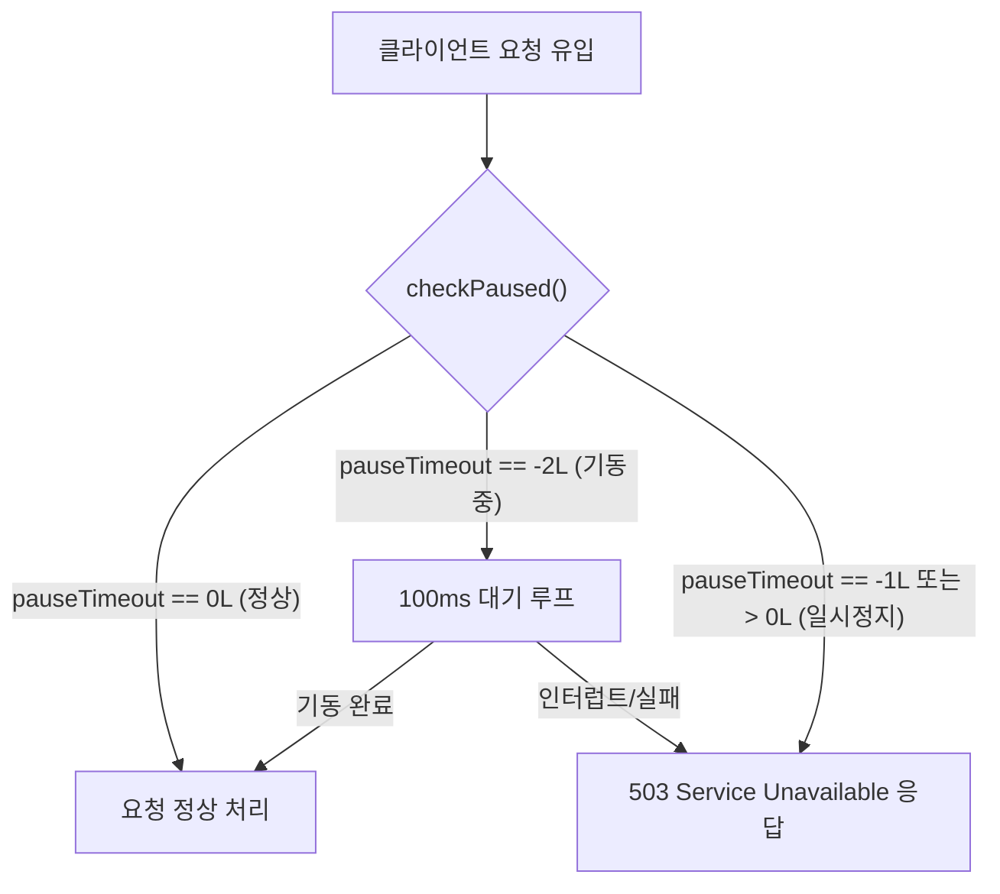
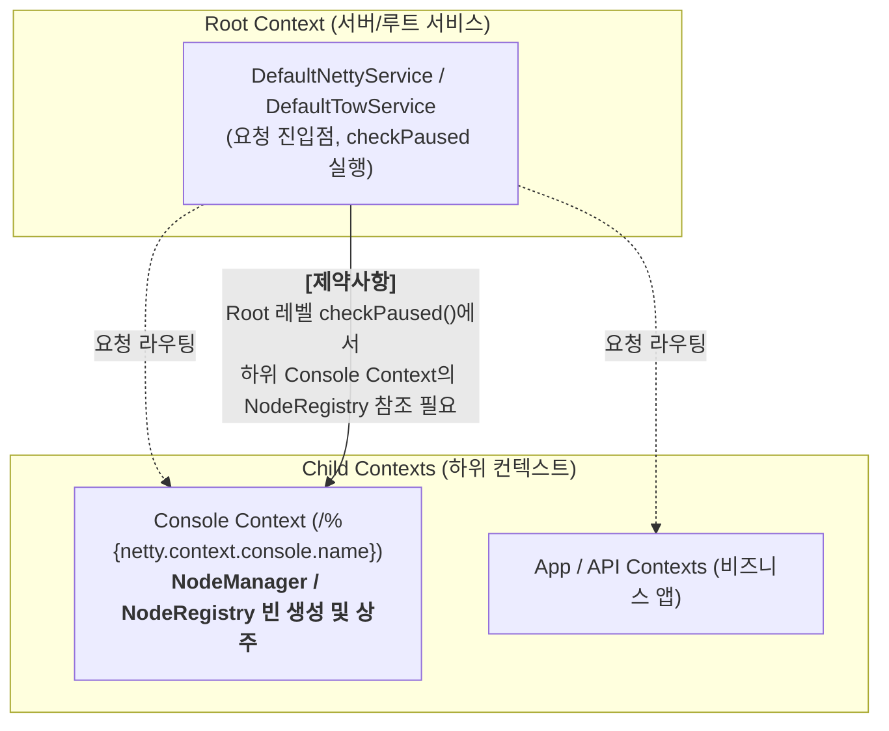
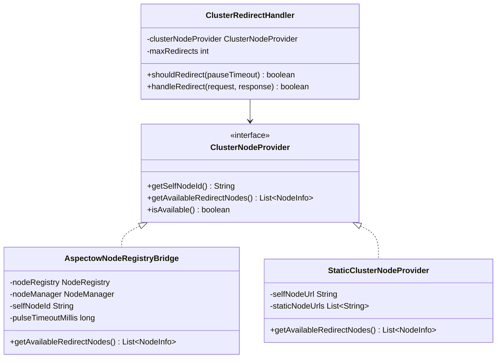
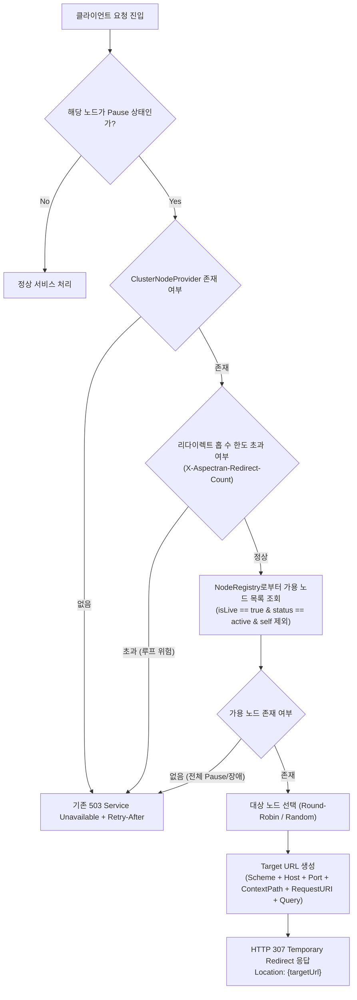


**안내:** 이 문서는 Aspectran 및 Aspectow 클러스터 환경에서 고가용성(HA)과 무중단 배포를 달성하기 위해 검토 중인 기술적 아이디어와 아키텍처 기획안을 공유하는 프리뷰 성격의 문서입니다.
본 기획안에 기술된 아키텍처 및 구현 방안은 실제 구현 여부와 구체적인 적용 일정이 확정되지 않은 초기 연구·기획 단계의 내용이며, 향후 기술 검토 결과 및 커뮤니티 피드백에 따라 변경되거나 구현되지 않을 수 있습니다.



이 문서는 다중 노드로 구성된 분산 클러스터 환경에서 특정 노드가 유지보수, 배포, 롤링 업데이트, 부하 조절 등의 이유로 일시정지(Pause) 상태로 전환되었을 때, 클러스터 내의 다른 가용(Active) 노드로 클라이언트 요청을 안전하게 우회(Redirect)시키는 기능의 아키텍처 설계와 단계별 구현 계획을 기술합니다.

특히 타 상용/오픈소스 WAS의 일시정지 메커니즘을 분석하여 비교하고, Aspectow 클러스터 아키텍처에서 **하위 컨텍스트(Console Context)**에 위치한 `NodeManager`와 `NodeRegistry`를 상위 **Root 컨텍스트(Web Service)**에서 효과적으로 참조하여 고가용성 라우팅을 수행하는 구체적인 메커니즘을 정의합니다.
<!--more-->

## 1. 개요 및 배경

Aspectran은 웹 서비스(`DefaultServletWebService`, `DefaultTowService`, `DefaultNettyService`) 및 코어 서비스 전반에 걸쳐 서비스 수명 주기 관리의 일환으로 `pause()` / `resume()` 및 `pauseTimeout` 기반의 일시정지 메커니즘을 제공하고 있습니다.



현재의 일시정지 처리 방식은 노드가 일시정지 상태(`pauseTimeout != 0L`)일 때 인입되는 모든 요청에 대해 `503 Service Unavailable` 상태 코드와 함께 `Retry-After` 헤더 및 안내 메시지를 응답하는 구조입니다.

그러나 여러 노드가 로드밸런서(L4/L7) 뒤에 배치되거나 클러스터 형태로 운영되는 실운영 환경에서는 다음과 같은 문제점이 발생합니다:

* **사용자 경험 단절**: 롤링 배포나 점검을 위해 특정 노드를 Pause 시켰을 때, 해당 노드로 진입한 요청이 즉시 503 에러를 수신하여 최종 사용자에게 에러 페이지가 노출됩니다.
* **로드밸런서 Failover 시차**: 외부 로드밸런서의 헬스체크 주기(보통 수 초~수십 초) 사이에 유입되는 인플라이트(In-flight) 요청들은 적절히 구제받지 못하고 실패 처리됩니다.
* **클러스터 자원 활용 미흡**: 클러스터 내 다른 노드들은 정상적으로 요청을 처리할 수 있는 여유가 있음에도 불구하고, 진입 노드가 Pause 상태라는 이유만으로 요청이 거부됩니다.

본 기획안은 노드가 Pause 상태로 진입했을 때, **Aspectow Node Manager(`NodeRegistry`)를 통해 클러스터 내 살아있는 다른 정상 노드의 주소를 실시간으로 파악하여 클라이언트에게 HTTP 307 리다이렉트를 지시하거나 로드밸런서와 연계하여 요청을 가용 노드로 우회**시키는 고가용성(HA) 라우팅 체계를 구축하는 것을 목표로 합니다.

## 2. 현행 일시정지(Pause) 아키텍처 및 한계

### 2.1. 현행 서비스 엔진별 checkPaused 동작

현재 Aspectran의 각 웹 서비스 엔진(`Servlet`, `Undertow`, `Netty`)은 요청 진입 최우선 단계에서 `checkPaused`를 검사합니다.



* **한계점**:
  * 단일 노드 관점의 에러 응답(`503`)만 수행하므로, 클러스터에 가용 노드가 존재하더라도 트래픽이 분산되지 못합니다.
  * 클라이언트는 요청 실패 후 수동으로 재시도해야 하거나 브라우저 오류를 경험하게 됩니다.

## 3. 타 상용/오픈소스 WAS 사례 비교 및 아키텍처적 차별성

전통적인 상용 및 오픈소스 WAS들도 무중단 운영과 점검을 위해 노드 일시정지(Quiesce/Suspend) 및 트래픽 우회 기능을 제공해 왔습니다. 각 WAS의 구현 방식과 Aspectran 기획의 차별성을 비교 분석합니다.

### 3.1. 주요 WAS들의 유사 기능 및 구현 방식

1. **Oracle WebLogic Server — Graceful Suspend & WebLogic Proxy Plugin**:
   * 서버 인스턴스를 `SUSPEND` 상태로 전환하면 신규 요청 유입을 차단하고 기존 세션 요청만 처리(Drain)합니다.
   * Apache/IIS 웹서버 플러그인(`mod_wl`) 또는 `HttpClusterServlet`(프록시 서블릿)이 클러스터 멤버 상태를 감지하여, Suspend된 노드로 인입되는 요청을 다른 활성 인스턴스로 **내부 프록시 포워딩(Failover)**합니다.
2. **Red Hat WildFly / JBoss EAP — `mod_cluster`**:
   * WAS 노드와 앞단 프록시(Apache httpd / Undertow) 간에 `mod_cluster` 전용 프로토콜(MCMP)을 사용합니다.
   * 노드가 Pause 또는 Graceful Shutdown 모드가 되면 앞단 프록시에 `DISABLE-APP` 또는 `STOP-APP` 메시지를 전파하여, 프록시가 해당 노드를 라우팅 목록에서 제외하고 타 노드로 트래픽을 우회시킵니다.
3. **IBM WebSphere Application Server — Quiesce Mode & ODR (On Demand Router)**:
   * 노드를 `Quiesce` 상태로 전환하면 지능형 라우터인 **ODR** 또는 WebSphere Web Server Plugin이 이를 감지하여 세션 어피니티(Session Affinity)를 유지한 채 가용 노드로 라우팅합니다.
4. **Tmax JEUS — Graceful Down & WebtoB 연동**:
   * `jeusadmin suspend-server` 명령으로 엔진을 일시정지하면, 연동된 전용 웹서버인 **WebtoB**에 IPC/TCP 통신으로 비활성 상태를 통보하고 WebtoB가 신규 트래픽을 타 JEUS 노드로 즉시 우회(Pass)시킵니다.

### 3.2. 전통적인 WAS 방식과 Aspectran 기획의 구조적 비교

| 비교 항목 | 전통적인 WAS (WebLogic, JEUS, WildFly 등) | Aspectran / Aspectow 기획안 |
| :--- | :--- | :--- |
| **우회 주체** | **앞단 전용 플러그인/웹서버** (WebtoB, mod_cluster, mod_wl 등) | **노드 자체 (Netty, Undertow, Servlet 엔진)** |
| **의존 인프라** | 전용 웹서버/플러그인이 반드시 앞단에 위치해야 함 | 전용 웹서버 없이 **독립 실행(Standalone/Microservice)** 환경에서도 동작 |
| **클러스터 상태 감지** | 독자적 멀티캐스트 또는 전용 관리 포트 통신 | **Redis / NodeRegistry**를 통한 분산 동기화 |
| **트래픽 우회 방식** | Reverse Proxy 레벨의 내부 포워딩 (서버 간 부하 지속) | **HTTP 307 Temporary Redirect** 표준 기반 (클라이언트가 직접 타 노드로 재전송) |
| **서버 자원 소모** | Pause 노드가 중계 프록시 역할을 하거나 플러그인에 종속 | Pause 노드는 307 응답 후 즉시 연결을 닫아 **서버 자원 소모 제로화** |

### 3.3. Aspectran 기획의 고유한 강점

* **전용 인프라 종속성 탈피**: 특정 웹서버 플러그인 없이도 L4 로드밸런서, 일반 Reverse Proxy(Nginx, Envoy, AWS ALB), 노드 직접 노출 환경 등 모든 인프라에서 동일하게 동작합니다.
* **HTTP 307 표준을 통한 초경량 우회**: 중계 프록시 방식과 달리 단 몇 바이트의 307 응답 후 소켓을 닫으므로, 점검 대상 노드의 I/O 및 CPU 부하를 즉시 완전히 비울 수 있습니다(Perfect Drain).
* **컨테이너/마이크로서비스 환경 최적화**: 파드(Pod) 단위로 독립 기동/종료되는 Docker/Kubernetes 환경에서 각 노드가 분산 레지스트리를 통해 자율 라우팅(Self-routing)을 수행하므로 현대적인 클라우드 아키텍처에 완벽히 부합합니다.

## 4. Aspectow 클러스터 환경과 컨텍스트 계층 제약사항 분석

### 4.1. Aspectow Node Manager 및 NodeRegistry 구조

Aspectow는 클러스터 환경에서 노드들의 생명주기, 메타데이터, Heartbeat(Pulse), 그룹, 엔드포인트를 관리하기 위해 `NodeManager`와 `NodeRegistry`를 핵심 엔진으로 사용합니다.

* **`NodeRegistry`의 핵심 역할**:
  * Redis 해시(`aspectow:cluster:nodes`, `pulses`, `groups`)를 기반으로 클러스터 전체 노드 메타데이터(`NodeInfo`)와 실시간 펄스 타임스탬프를 관리합니다.
  * `getNodes()`, `getNodeInfo(nodeId)`, `getNodesByGroup(groupId)`: 클러스터 내 노드 정보 및 통신 엔드포인트(`EndpointConfig`)를 제공합니다.
  * `isLive(nodeId, timeoutMillis)`: 펄스 주기를 검사하여 해당 노드가 현재 실제로 살아있는지 검증합니다.
  * `hasOtherNodesInGroup(groupId, excludeNodeId)`: 동일 그룹 내에 자신을 제외한 다른 가용 노드가 존재하는지 확인합니다.

### 4.2. 컨텍스트 계층 구조상의 제약사항 (Context Hierarchy Constraint)

Aspectow 아키텍처에서는 다음과 같은 컨텍스트 계층 구조가 형성됩니다:



* **핵심 제약사항**:
  1. **생성 위치 불일치**: `NodeManager` 및 `NodeRegistry` 빈은 일반적으로 `console` 컨텍스트(`netty-context-console.xml`, `tow-context-console.xml`)에서 초기화되어 해당 하위 컨텍스트의 `BeanRegistry`에 상주합니다.
  2. **검사 시점의 불일치**: 클라이언트의 HTTP 웹 요청을 가장 먼저 맞이하여 `checkPaused()`를 실행하는 곳은 최상위인 **Root 웹 서비스(`DefaultNettyService`, `DefaultTowService`, `DefaultServletWebService`)**입니다.
  3. **계층 참조 방향**: 일반적인 프레임워크 설계상 부모(Root) 컨텍스트는 자식(Console) 컨텍스트의 내부 빈을 직접 의존하지 않으므로, Root 서비스 레벨에서 하위 Console 컨텍스트의 `NodeRegistry`를 안전하게 획득하여 사용할 수 있는 연결 고리(Bridge)가 필요합니다.

## 5. 핵심 해결 방안 및 아키텍처 설계

### 5.1. Root-Console 컨텍스트 간 NodeRegistry 브리지 메커니즘

Root 컨텍스트의 웹 서비스가 하위 Console 컨텍스트의 `NodeRegistry`에 접근할 수 있도록 다음과 같은 3가지 연계 방안을 제공합니다.



#### 방안 1: Root Service 속성 기반 동적 바인딩 (추천)
`console` 컨텍스트가 구동되면서 `NodeManager`가 생성될 때, 부모 서비스(`getParentService()`)의 Attribute에 `NodeRegistry`를 등록하는 방식입니다.

```java
// Console 컨텍스트 초기화 시점 (NodeManagerFactoryBean 또는 초기화 리스너)
CoreService parentService = activityContext.getCoreService().getParentService();
if (parentService != null) {
    AspectowNodeRegistryBridge bridge = new AspectowNodeRegistryBridge(nodeManager);
    parentService.setAttribute(ClusterNodeProvider.ATTRIBUTE_NAME, bridge);
}
```

* **장점**:
  * Root 컨텍스트는 Aspectow 모듈을 직접 컴파일 의존하지 않고도 느슨하게 결합(`Loose Coupling`)된 상태로 `ClusterNodeProvider` 인터페이스를 통해 노드 목록을 조회할 수 있습니다.
  * Console 컨텍스트가 로드되지 않는 독립형(Standalone) 환경에서는 정적 설정(`StaticClusterNodeProvider`)으로 자연스럽게 Fallback 됩니다.

#### 방안 2: 자식 컨텍스트 탐색 (Child Context Traversal)
Root 서비스의 `checkPaused()` 시점에 자식 서비스 목록을 순회하여 `NodeManager` 또는 `NodeRegistry` 빈을 보유한 컨텍스트를 탐색하여 획득합니다.

#### 방안 3: 전역 공유 홀더 (Shared Context Registry)
`NodeRegistryHolder.set(nodeRegistry)`를 통해 JVM 단위 싱글톤 홀더에 등록하여 컨텍스트 계층에 상관없이 참조할 수 있도록 지원합니다.

### 5.2. HTTP 307 Temporary Redirect 기반 라우팅 메커니즘

일시정지 노드가 요청을 다른 노드로 우회시킬 때 `307 Temporary Redirect` 상태 코드를 사용합니다.



* **HTTP 307 선정 이유**:
  * `302 Found`는 클라이언트가 리다이렉트 대상 서버로 재요청할 때 `POST` 메서드를 `GET`으로 변조(Drop Body)하는 관행적 문제가 있습니다.
  * 반면 `307 Temporary Redirect`는 HTTP/1.1 명세(RFC 7231 / RFC 9110)에 따라 **원래 요청의 HTTP 메서드(`GET`, `POST`, `PUT`, `DELETE` 등)와 Request Body를 그대로 유지**하여 대상 서버로 전송하도록 강제합니다.
  * 따라서 파일 업로드, 폼 제출, REST API 호출 등 모든 유형의 HTTP 요청이 데이터 손실 없이 다른 노드로 완벽하게 전달됩니다.

* **응답 헤더 구성**:
  * `Location`: 대상 노드의 절대 URL (`https://node2.example.com:8080/path?query`)
  * `X-Aspectran-Redirect-Count`: 현재 리다이렉트 누적 횟수 (1씩 증가)
  * `X-Aspectran-Redirected-From`: 리다이렉트를 발행한 출발지 Node ID
  * `Connection`: `close`

### 5.3. NodeRegistry 기반 가용 노드 필터링 및 타깃 선정

`NodeRegistry`에서 제공하는 노드 목록 중 다음 기준을 만족하는 노드만 리다이렉트 타깃 후보로 선정합니다.

1. **자신 제외 (Self-Exclusion)**:
   * `nodeInfo.getId().equals(nodeManager.getNodeId())` 인 노드는 제외합니다.
2. **동일 그룹 우선 (Group Affinity)**:
   * 동일한 `groupId`를 가진 노드를 우선 대상으로 선정합니다.
3. **노드 상태 검증 (Status & Liveness Check)**:
   * `NodeInfo.getStatus()`가 `"active"`인 노드만 포함 (상태가 `"paused"`, `"inactive"`, `"starting"`인 노드 제외).
   * `NodeRegistry.isLive(nodeId, pulseTimeoutMillis)` 검사를 통해 최근 펄스(Pulse) 신호가 유효한 노드만 포함.
4. **콘솔 전용 노드 제외**:
   * `NodeInfo.isConsole() == true`인 노드는 일반 비즈니스 트래픽 처리 노드가 아니므로 대상에서 제외.

### 5.4. 타깃 URL 정합성 및 프록시 고려

* **URL 조립 규칙**:
  * `NodeInfo`의 `EndpointConfig` 또는 `host` / `port` 정보를 결합하여 베이스 URL을 결정합니다.
  $$\text{TargetBaseUrl} = \text{Scheme} + \text{"://"} + \text{NodeInfo.getHost()} + \text{":"} + \text{NodeInfo.getPort()}$$
  $$\text{Redirect URL} = \text{TargetBaseUrl} + \text{RequestURI} + (\text{QueryString} \neq \emptyset \;?\; \text{"?"} + \text{QueryString} : \text{""})$$
* **Reverse Proxy / SSL 오프로딩 고려**:
  * `X-Forwarded-Proto`, `X-Forwarded-Port`, `X-Forwarded-Path` 헤더를 분석하여 클라이언트가 원래 인입된 스킴(HTTP/HTTPS)에 맞춰 적절한 엔드포인트를 선택합니다.

### 5.5. 무한 루프 방지 및 안전장치 (Safety Mechanisms)

1. **Hop Count 헤더 검사 (`X-Aspectran-Redirect-Count`)**:
   * 인입 요청의 `X-Aspectran-Redirect-Count` 헤더 값을 정수로 파싱합니다 (헤더가 없으면 0).
   * 현재 횟수가 `maxRedirects`(기본값: 3회) 이상이면 리다이렉트를 즉시 중단하고 `503 Service Unavailable`을 응답합니다.
2. **클러스터 전체 Pause 감지 시 Fallback**:
   * 가용 가능한 Active 노드가 0개인 경우(모든 노드가 Pause 상태이거나 장애 상태인 경우), 즉시 기존의 503 에러 응답(`Retry-After` 포함)으로 Fallback 처리합니다.
3. **Loop Detection (방문 노드 추적)**:
   * `X-Aspectran-Visited-Nodes` 헤더에 방문한 Node ID 목록(`node-1,node-2`)을 누적 기록하여 이미 거쳐간 노드로 재리다이렉트되는 현상을 차단합니다.

## 6. 상세 컴포넌트 설계

### 6.1. 설정 스키마 정의 (APON)

`AspectranConfig` 또는 `WebConfig` 내에 `clusterRedirect` 설정을 정의합니다.

```apon
web: {
    pause: {
        clusterRedirect: {
            enabled: true
            maxRedirects: 3
            # Aspectow NodeManager 연동 시 자동 감지(auto)
            mode: "aspectow"   # aspectow, static

            # mode가 static인 경우의 fallback 설정
            staticNodes: [
                "https://node1.example.com"
                "https://node2.example.com"
                "https://node3.example.com"
            ]
        }
    }
}
```

### 6.2. 각 Web Service의 checkPaused 통합 로직

`DefaultServletWebService`, `DefaultTowService`, `DefaultNettyService`의 `checkPaused` 메서드에 일관되게 적용됩니다.

```java
private boolean checkPaused(...) {
    if (pauseTimeout != 0L) {
        if (pauseTimeout == -2L) {
            // 1. 초기 기동 대기 처리
            ...
        }

        if (pauseTimeout == -1L || pauseTimeout >= System.currentTimeMillis()) {
            if (logger.isDebugEnabled()) {
                logger.debug("{} is paused, checking cluster redirect...", getServiceName());
            }

            // 2. 클러스터 리다이렉트 시도
            if (clusterRedirectHandler != null && clusterRedirectHandler.isEnabled()) {
                boolean redirected = clusterRedirectHandler.redirectIfPossible(ctx, request);
                if (redirected) {
                    return true;
                }
            }

            // 3. 리다이렉트 불가 시 기존 503 에러 응답 (Retry-After 포함)
            ...
            sendError(..., HttpStatus.SERVICE_UNAVAILABLE, msg, retryAfter);
            return true;
        } else {
            pauseTimeout = 0L;
        }
    }
    return false;
}
```

## 7. 단계별 구현 로드맵

### Phase 1: 기본 리다이렉트 핸들러 및 SPI 설계 (Core/Web 레벨)
* `ClusterNodeProvider` SPI 인터페이스 및 `ClusterRedirectHandler` 구현
* `StaticClusterNodeProvider` 구현 (정적 URL 목록 기반 기본 동작 검증)
* `DefaultServletWebService`, `DefaultTowService`, `DefaultNettyService`의 `checkPaused`에 `ClusterRedirectHandler` 연동
* `X-Aspectran-Redirect-Count` 기반 무한 루프 방지 및 503 Fallback 단위 테스트 작성

### Phase 2: Aspectow NodeManager/NodeRegistry 브리지 구현 (Aspectow 레벨)
* `AspectowNodeRegistryBridge` 구현 (`NodeRegistry.getNodes()`, `isLive()`, `status` 필터링 연동)
* `console` 컨텍스트 초기화 시 부모(Root) 서비스의 `ClusterNodeProvider`에 Bridge 인스턴스를 동적 등록하는 바인딩 로직 구현
* 노드 Pause/Resume 시 `NodeReporter`를 통해 Redis 상의 노드 상태(`status: "paused"`)를 즉각 업데이트하여 타 노드가 리다이렉트 대상에서 즉시 제외할 수 있도록 연계
* 멀티 노드(Netty/Undertow) 환경에서 한 노드 Pause 시 타 노드로의 307 리다이렉트 통합 테스트 검증

### Phase 3: Aspectow Console UI 연계 및 AppMon 모니터링
* Aspectow Console 대시보드에 노드별 Pause 상태 및 클러스터 간 리다이렉트 통계 지표 표기
* 로드밸런서(L4/L7) 헬스체크 프로브와 연계 가능한 헬스 엔드포인트 연동

## 8. 기대 효과

* **무중단 롤링 배포 및 점검**: 특정 노드를 Pause 하더라도 인입 트래픽이 즉시 클러스터 내 다른 가용 노드로 307 리다이렉트되어 사용자 요청 실패가 발생하지 않습니다.
* **전용 웹서버/플러그인 종속성 제거**: WebLogic, JEUS, WildFly 등 기존 WAS와 달리 전용 웹서버 플러그인 없이도 독립적으로 완벽한 트래픽 우회를 수행합니다.
* **컨텍스트 계층의 완벽한 분리 및 연계**: Root 컨텍스트의 순수 웹 서비스 엔진과 하위 Console 컨텍스트의 Aspectow `NodeManager`가 느슨한 결합(SPI)을 유지하며 안전하게 연동됩니다.
* **데이터 무손실 보장**: HTTP 307 표준을 준수하여 대용량 파일 업로드 및 `POST`/`PUT` 요청의 Body 손실 없이 완전한 요청 처리를 보장합니다.
